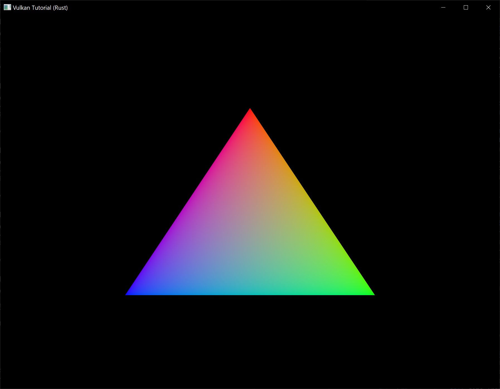
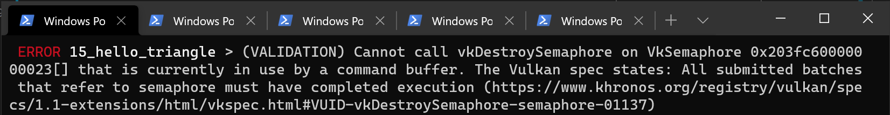

# Rendering and presentation

**Code:** [main.rs](https://github.com/KyleMayes/vulkanalia/tree/master/tutorial/src/15_hello_triangle.rs)

This is the chapter where everything is going to come together. We're going to implement the `App::render` function that will be called from the main loop to put the triangle on the screen.

## Synchronization

The `App::render` function will perform the following operations:

* Acquire an image from the swapchain
* Execute the command buffer with that image as attachment in the framebuffer
* Return the image to the swapchain for presentation

Each of these events is set in motion using a single function call, but they are executed asynchronously. The function calls will return before the operations are actually finished and the order of execution is also undefined. That is unfortunate, because each of the operations depends on the previous one finishing.

There are two ways of synchronizing swapchain events: fences and semaphores. They're both objects that can be used for coordinating operations by having one operation signal and another operation wait for a fence or semaphore to go from the unsignaled to signaled state.

The difference is that the state of fences can be accessed from your program using calls like `wait_for_fences` and semaphores cannot be. Fences are mainly designed to synchronize your application itself with rendering operation, whereas semaphores are used to synchronize operations within or across command queues. We want to synchronize the queue operations of draw commands and presentation, which makes semaphores the best fit.

## Semaphores

We'll need one semaphore to signal that an image has been acquired and is ready for rendering, and another one to signal that rendering has finished and presentation can happen. Create two `AppData` fields to store these semaphore objects:

```rust,noplaypen
struct AppData {
    // ...
    image_available_semaphore: vk::Semaphore,
    render_finished_semaphore: vk::Semaphore,
}
```

To create the semaphores, we'll add the last `create` function for this part of the tutorial, `create_sync_objects`:

```rust,noplaypen
impl App {
    unsafe fn create(window: &Window) -> Result<Self> {
        // ...
        create_command_buffers(&device, &mut data)?;
        create_sync_objects(&device, &mut data)?;
        // ...
    }
}

unsafe fn create_sync_objects(device: &Device, data: &mut AppData) -> Result<()> {
    Ok(())
}
```

Creating semaphores requires filling in the `vk::SemaphoreCreateInfo`, but in the current version of the API it doesn't actually have any required fields.

```rust,noplaypen
unsafe fn create_sync_objects(device: &Device, data: &mut AppData) -> Result<()> {
    let semaphore_info = vk::SemaphoreCreateInfo::builder();

    Ok(())
}
```

Future versions of the Vulkan API or extensions may add functionality for the `flags` and `p_next` parameters like it does for the other structures. Creating the semaphores follows the familiar pattern:

```rust,noplaypen
data.image_available_semaphore = device.create_semaphore(&semaphore_info, None)?;
data.render_finished_semaphore = device.create_semaphore(&semaphore_info, None)?;
```

The semaphores should be cleaned up at the end of the program, when all commands have finished and no more synchronization is necessary:

```rust,noplaypen
unsafe fn destroy(&mut self) {
    self.device.destroy_semaphore(self.data.render_finished_semaphore, None);
    self.device.destroy_semaphore(self.data.image_available_semaphore, None);
    // ...
}
```

## Acquiring an image from the swapchain

As mentioned before, the first thing we need to do in the `App::render` function is acquire an image from the swapchain. Recall that the swapchain is an extension feature, so we must use a function with the `*_khr` naming convention:

```rust,noplaypen
unsafe fn render(&mut self, window: &Window) -> Result<()> {
    let image_index = self
        .device
        .acquire_next_image_khr(
            self.data.swapchain,
            u64::max_value(),
            self.data.image_available_semaphore,
            vk::Fence::null(),
        )?
        .0 as usize;

        let wait_semaphores = &[self.data.image_available_semaphore];
let wait_stages = &[vk::PipelineStageFlags::COLOR_ATTACHMENT_OUTPUT];
let command_buffers = &[self.data.command_buffers[image_index as usize]];
let signal_semaphores = &[self.data.render_finished_semaphore];
let submit_info = vk::SubmitInfo::builder()
    .wait_semaphores(wait_semaphores)
    .wait_dst_stage_mask(wait_stages)
    .command_buffers(command_buffers)
    .signal_semaphores(signal_semaphores);

    self.device.queue_submit(
    self.data.graphics_queue, &[submit_info], vk::Fence::null())?;

    Ok(())
}
```

The first parameter of `acquire_next_image_khr` is the swapchain from which we wish to acquire an image. The second parameter specifies a timeout in nanoseconds for an image to become available. Using the maximum value of a 64 bit unsigned integer disables the timeout.

The next two parameters specify synchronization objects that are to be signaled when the presentation engine is finished using the image. That's the point in time where we can start drawing to it. It is possible to specify a semaphore, fence or both. We're going to use our `image_available_semaphore` for that purpose here.

This function returns the index of the swapchain image that has become available. The index refers to the `vk::Image` in our `swapchain_images` array. We're going to use that index to pick the right command buffer.

## Submitting the command buffer

Queue submission and synchronization is configured through parameters in the `vk::SubmitInfo` structure.

```rust,noplaypen
let wait_semaphores = &[self.data.image_available_semaphore];
let wait_stages = &[vk::PipelineStageFlags::COLOR_ATTACHMENT_OUTPUT];
let command_buffers = &[self.data.command_buffers[image_index as usize]];
let signal_semaphores = &[self.data.render_finished_semaphore];
let submit_info = vk::SubmitInfo::builder()
    .wait_semaphores(wait_semaphores)
    .wait_dst_stage_mask(wait_stages)
    .command_buffers(command_buffers)
    .signal_semaphores(signal_semaphores);
```

The first two parameters, `^wait_semaphores` and `wait_dst_stage_mask`, specifies which semaphores to wait on before execution begins and in which stage(s) of the pipeline to wait. We want to wait with writing colors to the image until it's available, so we're specifying the stage of the graphics pipeline that writes to the color attachment. That means that theoretically the implementation can already start executing our vertex shader and such while the image is not yet available. Each entry in the `wait_stages` array corresponds to the semaphore with the same index in `^wait_semaphores`.

The next parameter, `command_buffers`, specifies which command buffers to actually submit for execution. As mentioned earlier, we should submit the command buffer that binds the swapchain image we just acquired as color attachment.

Lastly `signal_semaphores` specifies which semaphores to signal once the command buffer(s) have finished execution. In our case we're using the `render_finished_semaphore` for that purpose.

```rust,noplaypen
self.device.queue_submit(
    self.data.graphics_queue, &[submit_info], vk::Fence::null())?;
```

We can now submit the command buffer to the graphics queue using `queue_submit`. The function takes an array of `vk::SubmitInfo` structures as argument for efficiency when the workload is much larger. The last parameter references an optional fence that will be signaled when the command buffers finish execution. We're using semaphores for synchronization, so we'll just pass a `vk::Fence::null()`.

## Subpass dependencies

Remember that the subpasses in a render pass automatically take care of image layout transitions. These transitions are controlled by *subpass dependencies*, which specify memory and execution dependencies between subpasses. We have only a single subpass right now, but the operations right before and right after this subpass also count as implicit "subpasses".

There are two built-in dependencies that take care of the transition at the start of the render pass and at the end of the render pass, but the former does not occur at the right time. It assumes that the transition occurs at the start of the pipeline, but we haven't acquired the image yet at that point! There are two ways to deal with this problem. We could change the `wait_stages` for the `image_available_semaphore` to `vk::PipelineStageFlags::TOP_OF_PIPE` to ensure that the render passes don't begin until the image is available, or we can make the render pass wait for the `vk::PipelineStageFlags::COLOR_ATTACHMENT_OUTPUT` stage. I've decided to go with the second option here, because it's a good excuse to have a look at subpass dependencies and how they work.

Subpass dependencies are specified in `vk::SubpassDependency` structs. Go to our `^create_render_pass` function and add one:

```rust,noplaypen
let dependency = vk::SubpassDependency::builder()
    .src_subpass(vk::SUBPASS_EXTERNAL)
    .dst_subpass(0)
    // continued...
```

The first two fields specify the indices of the dependency and the dependent subpass. The special value `vk::SUBPASS_EXTERNAL` refers to the implicit subpass before or after the render pass depending on whether it is specified in `src_subpass` or `dst_subpass`. The index `0` refers to our subpass, which is the first and only one. The `dst_subpass` must always be higher than `src_subpass` to prevent cycles in the dependency graph (unless one of the subpasses is `vk::SUBPASS_EXTERNAL`).

```rust,noplaypen
    .src_stage_mask(vk::PipelineStageFlags::COLOR_ATTACHMENT_OUTPUT)
    .src_access_mask(vk::AccessFlags::empty())
```

The next two fields specify the operations to wait on and the stages in which these operations occur. We need to wait for the swapchain to finish reading from the image before we can access it. This can be accomplished by waiting on the color attachment output stage itself.

```rust,noplaypen
    .dst_stage_mask(vk::PipelineStageFlags::COLOR_ATTACHMENT_OUTPUT)
    .dst_access_mask(vk::AccessFlags::COLOR_ATTACHMENT_WRITE);
```

The operations that should wait on this are in the color attachment stage and involve the writing of the color attachment. These settings will prevent the transition from happening until it's actually necessary (and allowed): when we want to start writing colors to it.

```rust,noplaypen
let attachments = &[color_attachment];
let subpasses = &[subpass];
let dependencies = &[dependency];
let info = vk::RenderPassCreateInfo::builder()
    .attachments(attachments)
    .subpasses(subpasses)
    .dependencies(dependencies);
```

The `vk::RenderPassCreateInfo` struct has a field to specify an array of dependencies.

## Presentation

The last step of drawing a frame is submitting the result back to the swapchain to have it eventually show up on the screen. Presentation is configured through a `vk::PresentInfoKHR` structure at the end of the `App::render` function.

```rust,noplaypen
let swapchains = &[self.data.swapchain];
let image_indices = &[image_index as u32];
let present_info = vk::PresentInfoKHR::builder()
    .wait_semaphores(signal_semaphores)
    .swapchains(swapchains)
    .image_indices(image_indices);
```

The first parameter specifies which semaphores to wait on before presentation can happen, just like `vk::SubmitInfo`.

The next two parameters specify the swapchains to present images to and the index of the image for each swapchain. This will almost always be a single one.

There is one last optional parameter called `results`. It allows you to specify an array of `vk::Result` values to check for every individual swapchain if presentation was successful. It's not necessary if you're only using a single swapchain, because you can simply use the return value of the present function.

```rust,noplaypen
self.device.queue_present_khr(self.data.present_queue, &present_info)?;
```

The `queue_present_khr` function submits the request to present an image to the swapchain. We'll modify the error handling for both `acquire_next_image_khr` and `queue_present_khr` in the next chapter, because their failure does not necessarily mean that the program should terminate, unlike the functions we've seen so far.

If you did everything correctly up to this point, then you should now see something resembling the following when you run your program:



>This colored triangle may look a bit different from the one you're used to seeing in graphics tutorials. That's because this tutorial lets the shader interpolate in linear color space and converts to sRGB color space afterwards. See [this blog post](https://medium.com/@heypete/hello-triangle-meet-swift-and-wide-color-6f9e246616d9) for a discussion of the difference.

Yay! Unfortunately, you'll see that when validation layers are enabled, the program crashes as soon as you close it. The messages printed to the terminal from `debug_callback` tell us why:



Remember that all of the operations in `App::render` are asynchronous. That means that when we call `App::destroy` before exiting the loop in `main`, drawing and presentation operations may still be going on. Cleaning up resources while that is happening is a bad idea.

To fix that problem, we should wait for the logical device to finish operations using `device_wait_idle` before calling `App::destroy`:

```rust,noplaypen
Event::WindowEvent { event: WindowEvent::CloseRequested, .. } => {
    destroying = true;
    *control_flow = ControlFlow::Exit;
    unsafe { app.device.device_wait_idle().unwrap(); }
    unsafe { app.destroy(); }
}
```

You can also wait for operations in a specific command queue to be finished with `queue_wait_idle`. These functions can be used as a very rudimentary way to perform synchronization. You'll see that the program no longer crashes when closing the window (though you will see some errors related to synchronization if you have the validation layers enabled).

## Frames in flight

If you run your application with validation layers enabled now you may either get errors or notice that the memory usage slowly grows. The reason for this is that the application is rapidly submitting work in the `App::render` function, but doesn't actually check if any of it finishes. If the CPU is submitting work faster than the GPU can keep up with then the queue will slowly fill up with work. Worse, even, is that we are reusing the `image_available_semaphore` and `render_finished_semaphore` semaphores, along with the command buffers, for multiple frames at the same time!

The easy way to solve this is to wait for work to finish right after submitting it, for example by using `queue_wait_idle` (note: don't actually make this change):

```rust,noplaypen
unsafe fn render(&mut self, window: &Window) -> Result<()> {
    // ...

    self.device.queue_present_khr(self.data.present_queue, &present_info)?;
    self.device.queue_wait_idle(self.data.present_queue)?;

    Ok(())
}
```

However, we are likely not optimally using the GPU in this way, because the whole graphics pipeline is only used for one frame at a time right now. The stages that the current frame has already progressed through are idle and could already be used for a next frame. We will now extend our application to allow for multiple frames to be *in-flight* while still bounding the amount of work that piles up.

Start by adding a constant at the top of the program that defines how many frames should be processed concurrently:

```rust,noplaypen
const MAX_FRAMES_IN_FLIGHT: usize = 2;
```

Each frame should have its own set of semaphores in `AppData`:

```rust,noplaypen
struct AppData {
    // ...
    image_available_semaphores: Vec<vk::Semaphore>,
    render_finished_semaphores: Vec<vk::Semaphore>,
}
```

The `create_sync_objects` function should be changed to create all of these:

```rust,noplaypen
unsafe fn create_sync_objects(device: &Device, data: &mut AppData) -> Result<()> {
    let semaphore_info = vk::SemaphoreCreateInfo::builder();

    for _ in 0..MAX_FRAMES_IN_FLIGHT {
        data.image_available_semaphores
            .push(device.create_semaphore(&semaphore_info, None)?);
        data.render_finished_semaphores
            .push(device.create_semaphore(&semaphore_info, None)?);
    }

    Ok(())
}
```

Similarly, they should also all be cleaned up:

```rust,noplaypen
unsafe fn destroy(&mut self) {
    self.data.render_finished_semaphores
        .iter()
        .for_each(|s| self.device.destroy_semaphore(*s, None));
    self.data.image_available_semaphores
        .iter()
        .for_each(|s| self.device.destroy_semaphore(*s, None));
    // ...
}
```

To use the right pair of semaphores every time, we need to keep track of the current frame. We will use a frame index for that purpose which we'll add to `App` (initialize it to `0` in `App::create`):

```rust,noplaypen
struct App {
    // ...
    frame: usize,
}
```

The `App::render` function can now be modified to use the right objects:

```rust,noplaypen
unsafe fn render(&mut self, window: &Window) -> Result<()> {
    let image_index = self
        .device
        .acquire_next_image_khr(
            self.data.swapchain,
            u64::max_value(),
            self.data.image_available_semaphores[self.frame],
            vk::Fence::null(),
        )?
        .0 as usize;

    // ...

    let wait_semaphores = &[self.data.image_available_semaphores[self.frame]];

    // ...

    let signal_semaphores = &[self.data.render_finished_semaphores[self.frame]];

    // ...

    Ok(())
}
```

Of course, we shouldn't forget to advance to the next frame every time:

```rust,noplaypen
unsafe fn render(&mut self, window: &Window) -> Result<()> {
    // ...

    self.frame = (self.frame + 1) % MAX_FRAMES_IN_FLIGHT;

    Ok(())
}
```

By using the modulo (%) operator, we ensure that the frame index loops around after every `MAX_FRAMES_IN_FLIGHT` enqueued frames.

Although we've now set up the required objects to facilitate processing of multiple frames simultaneously, we still don't actually prevent more than `MAX_FRAMES_IN_FLIGHT` from being submitted. Right now there is only GPU-GPU synchronization and no CPU-GPU synchronization going on to keep track of how the work is going. We may be using the frame #0 objects while frame #0 is still in-flight!

To perform CPU-GPU synchronization, Vulkan offers a second type of synchronization primitive called *fences*. Fences are similar to semaphores in the sense that they can be signaled and waited for, but this time we actually wait for them in our own code. We'll first create a fence for each frame in `AppData`:

```rust,noplaypen
struct AppData {
    // ...
    in_flight_fences: Vec<vk::Fence>,
}
```

We'll create the fences together with the semaphores in the `create_sync_objects` function:

```rust,noplaypen
unsafe fn create_sync_objects(device: &Device, data: &mut AppData) -> Result<()> {
    let semaphore_info = vk::SemaphoreCreateInfo::builder();
    let fence_info = vk::FenceCreateInfo::builder();

    for _ in 0..MAX_FRAMES_IN_FLIGHT {
        data.image_available_semaphores
            .push(device.create_semaphore(&semaphore_info, None)?);
        data.render_finished_semaphores
            .push(device.create_semaphore(&semaphore_info, None)?);

        data.in_flight_fences.push(device.create_fence(&fence_info, None)?);
    }

    Ok(())
}
```

The creation of fences (`vk::Fence`) is very similar to the creation of semaphores. Also make sure to clean up the fences in `App::destroy`:

```rust,noplaypen
unsafe fn destroy(&mut self) {
    self.data.in_flight_fences
        .iter()
        .for_each(|f| self.device.destroy_fence(*f, None));
    // ...
}
```

We will now change `App::render` to use the fences for synchronization. The `queue_submit` call includes an optional parameter to pass a fence that should be signaled when the command buffer finishes executing. We can use this to signal that a frame has finished.

```rust,noplaypen
unsafe fn render(&mut self, window: &Window) -> Result<()> {
    // ...

    self.device.queue_submit(
        self.data.graphics_queue,
        &[submit_info],
        self.data.in_flight_fences[self.frame],
    )?;

    // ...
}
```

Now the only thing remaining is to change the beginning of `App::render` to wait for the frame to be finished:

```rust,noplaypen
unsafe fn render(&mut self, window: &Window) -> Result<()> {
    self.device.wait_for_fences(
        &[self.data.in_flight_fences[self.frame]],
        true,
        u64::max_value(),
    )?;

    self.device.reset_fences(&[self.data.in_flight_fences[self.frame]])?;

    // ...
}
```

The `wait_for_fences` function takes an array of fences and waits for either any or all of them to be signaled before returning. The `true` we pass here indicates that we want to wait for all fences, but in the case of a single one it obviously doesn't matter. Just like `acquire_next_image_khr` this function also takes a timeout. Unlike the semaphores, we manually need to restore the fence to the unsignaled state by resetting it with the `reset_fences` call.

If you run the program now, you'll notice something something strange. The application no longer seems to be rendering anything and might even be frozen.

That means that we're waiting for a fence that has not been submitted. The problem here is that, by default, fences are created in the unsignaled state. That means that `wait_for_fences` will wait forever if we haven't used the fence before. To solve that, we can change the fence creation to initialize it in the signaled state as if we had rendered an initial frame that finished:

```rust,noplaypen
unsafe fn create_sync_objects(device: &Device, data: &mut AppData) -> Result<()> {
    // ...

    let fence_info = vk::FenceCreateInfo::builder()
        .flags(vk::FenceCreateFlags::SIGNALED);

    // ...
}
```

The memory leak is gone now, but the program is not quite working correctly yet. If `MAX_FRAMES_IN_FLIGHT` is higher than the number of swapchain images or `acquire_next_image_khr` returns images out-of-order then it's possible that we may start rendering to a swapchain image that is already *in flight*. To avoid this, we need to track for each swapchain image if a frame in flight is currently using it. This mapping will refer to frames in flight by their fences so we'll immediately have a synchronization object to wait on before a new frame can use that image.

First add a new list called `images_in_flight` to `AppData` to track this:

```rust,noplaypen
struct AppData {
    // ...
    in_flight_fences: Vec<vk::Fence>,
    images_in_flight: Vec<vk::Fence>,
}
```

Prepare it in `create_sync_objects`:

```rust,noplaypen
unsafe fn create_sync_objects(device: &Device, data: &mut AppData) -> Result<()> {
    // ...

    data.images_in_flight = data.swapchain_images
        .iter()
        .map(|_| vk::Fence::null())
        .collect();

    Ok(())
}
```

Initially not a single frame is using an image so we explicitly initialize it to *no fence*. Now we'll modify `App::render` to wait on any previous frame that is using the image that we've just been assigned for the new frame:

```rust,noplaypen
unsafe fn render(&mut self, window: &Window) -> Result<()> {
    // ...

    let image_index = self
        .device
        .acquire_next_image_khr(
            self.data.swapchain,
            u64::max_value(),
            self.data.image_available_semaphores[self.frame],
            vk::Fence::null(),
        )?
        .0 as usize;

    if !self.data.images_in_flight[image_index as usize].is_null() {
        self.device.wait_for_fences(
            &[self.data.images_in_flight[image_index as usize]],
            true,
            u64::max_value(),
        )?;
    }

    self.data.images_in_flight[image_index as usize] =
        self.data.in_flight_fences[self.frame];

    // ...
}
```

Because we now have more calls to `wait_for_fences`, the `reset_fences` call should be **moved**. It's best to simply call it right before actually using the fence:

```rust,noplaypen
unsafe fn render(&mut self, window: &Window) -> Result<()> {
    // ...

    self.device.reset_fences(&[self.data.in_flight_fences[self.frame]])?;

    self.device.queue_submit(
        self.data.graphics_queue,
        &[submit_info],
        self.data.in_flight_fences[self.frame],
    )?;

    // ...
}
```

We've now implemented all the needed synchronization to ensure that there are no more than two frames of work enqueued and that these frames are not accidentally using the same image. Note that it is fine for other parts of the code, like the final cleanup, to rely on more rough synchronization like `device_wait_idle`. You should decide on which approach to use based on performance requirements.

To learn more about synchronization through examples, have a look at [this extensive overview](https://github.com/KhronosGroup/Vulkan-Docs/wiki/Synchronization-Examples#swapchain-image-acquire-and-present) by Khronos.

## Conclusion

A little over 600 (non-empty) lines of code later, we've finally gotten to the stage of seeing something pop up on the screen! Bootstrapping a Vulkan program is definitely a lot of work, but the take-away message is that Vulkan gives you an immense amount of control through its explicitness. I recommend you to take some time now to reread the code and build a mental model of the purpose of all of the Vulkan objects in the program and how they relate to each other. We'll be building on top of that knowledge to extend the functionality of the program from this point on.

In the next chapter we'll deal with one more small thing that is required for a well-behaved Vulkan program.
