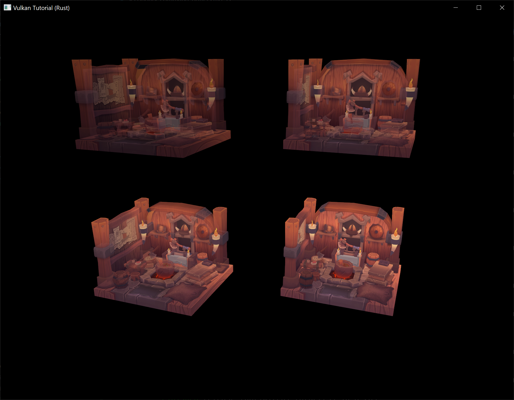

# Secondary command buffers

> <span style="display: flex; justify-content: center; margin-bottom: 16px"></span>The previous chapters of this tutorial that are not marked by this disclaimer were directly adapted from <https://github.com/Overv/VulkanTutorial>.<br/><br/>This chapter and the following chapters are instead original creations from someone who is most decidedly not an expert in Vulkan. An authoritative tone has been maintained, but these chapters should be considered a "best effort" by someone still learning Vulkan.<br/><br/>If you have questions, suggestions, or corrections, please [open an issue](https://github.com/KyleMayes/vulkanalia/issues)!

**Code:** [main.rs](https://github.com/KyleMayes/vulkanalia/tree/master/tutorial/src/32_secondary_command_buffers.rs)

While our program now submits different commands to be executed every frame, we still haven't quite accomplished our original goal of changing *what* our program renders dynamically. In this chapter we'll alter our program to support rendering between 1 and 4 instances of the model in response to user input.

We'll accomplish this using *secondary command buffers*, a Vulkan feature that allows us to build re-usable sequences of commands and then execute those commands from *primary command buffers*. Secondary command buffers aren't at all necessary to implement this change, but our first time rendering multiple things is a good time to introduce them.

## Primary vs secondary

All of the command buffers we've used thus far have been primary command buffers, meaning they can be submitted directly to a Vulkan queue to be executed by the device. Secondary command buffers are instead executed indirectly by being called from primary command buffers and may not be submitted to queues.

The usage of secondary command buffers offers two primary advantages:

1. Secondary command buffers may be allocated and recorded in parallel which allows you to better leverage modern hardware with its panoply of CPU cores

2. The lifetime of secondary command buffers can managed independently of one another so you can have a mixture of long-lived or permanent secondary command buffers that intermingle with frequently updated secondary command buffers which allows you to reduce the number of command buffers you need to create every frame

Both of these points are true for primary command buffers as well, but primary command buffers have a significant limitation that effectively prevents them from fulfilling these use cases. Multiple primary command buffers may not be executed within the same render pass instance meaning that if you wanted to execute multiple primary command buffers for a frame, each primary command buffer would need to start with `cmd_begin_render_pass` and end with `cmd_end_render_pass`.

This might not sound like a big deal but beginning a render pass instance can be a pretty heavyweight operation and needing to do this many times per frame can destroy performance on some hardware. Secondary command buffers avoid this problem by being able to inherit the render pass instance as well as other state from the primary command buffer it is called from.

## Multiple model instances

Let's get started by adding a field to `AppData` that will contain our new secondary command buffers. We will have multiple secondary command buffers per frame, one for each model instance we are rendering, so this will be a list of lists.

```rust,noplaypen
struct AppData {
    // ...
    command_buffers: Vec<vk::CommandBuffer>,
    secondary_command_buffers: Vec<Vec<vk::CommandBuffer>>,
    // ...
}
```

In an application more realistic than the one we are building, the number of secondary command buffers we need to render a frame might vary significantly over time. In addition, we likely wouldn't know the maximum number of secondary command buffers the application needs ahead of time.

We do know the maximum in this case, but we will pretend we don't and adopt an approach closer to what a real-world application would. Instead of allocating secondary command buffers during initialization like we allocate primary command buffers, we will allocate secondary command buffers on-demand. We'll still need to populate the outer `Vec` with empty lists of secondary command buffers so update `create_command_buffers` to accomplish this.

```rust,noplaypen
unsafe fn create_command_buffers(device: &Device, data: &mut AppData) -> Result<()> {
    // ...

    data.secondary_command_buffers = vec![vec![]; data.swapchain_images.len()];

    Ok(())
}
```

Add a new method for the `App` struct called `update_secondary_command_buffer` that we'll use to allocate (if necessary) and record a secondary command buffer for one of the 4 model instances we will be rendering. The `model_index` parameter indicates which of the 4 model instances the secondary command buffer should render.

```rust,noplaypen
unsafe fn update_secondary_command_buffer(
    &mut self,
    image_index: usize,
    model_index: usize,
) -> Result<vk::CommandBuffer> {
    self.data.secondary_command_buffers.resize_with(image_index + 1, Vec::new);
    let command_buffers = &mut self.data.secondary_command_buffers[image_index];
    while model_index >= command_buffers.len() {
        let allocate_info = vk::CommandBufferAllocateInfo::builder()
            .command_pool(self.data.command_pools[image_index])
            .level(vk::CommandBufferLevel::SECONDARY)
            .command_buffer_count(1);

        let command_buffer = self.device.allocate_command_buffers(&allocate_info)?[0];
        command_buffers.push(command_buffer);
    }

    let command_buffer = command_buffers[model_index];

    let info = vk::CommandBufferBeginInfo::builder();

    self.device.begin_command_buffer(command_buffer, &info)?;

    self.device.end_command_buffer(command_buffer)?;

    Ok(command_buffer)
}
```

This code will allocate secondary command buffers for the model instances as they are needed but will reuse them after their initial allocation. Like with the primary command buffers, we can freely use any previously allocated secondary command buffers because we are resetting the command pool they were allocated with.

Before we continue, we need to provide some additional information to Vulkan that is unique to secondary command buffers before recording this command buffer. Create an instance of `vk::CommandBufferInheritanceInfo` that specifies the render pass, subpass index, and framebuffer the secondary command buffer will be used in conjunction with and then provide that inheritance info to `begin_command_buffer`.

```rust,noplaypen
let inheritance_info = vk::CommandBufferInheritanceInfo::builder()
    .render_pass(self.data.render_pass)
    .subpass(0)
    .framebuffer(self.data.framebuffers[image_index]);

let info = vk::CommandBufferBeginInfo::builder()
    .inheritance_info(&inheritance_info);

self.device.begin_command_buffer(command_buffer, &info)?;
```

As mentioned previously, secondary command buffers can inherit some state from the primary command buffers they are executed from. This inheritance info describes the command buffer state the secondary command buffer will be compatible with and may validly inherit.

The render pass and subpass index are *required* to inherit that state, but the framebuffer is only specified here as a potential performance boost. You may omit it, but Vulkan may be able to better optimize the secondary command buffer to render to the specified framebuffer.

This isn't enough to actually inherit the render pass, we need to also provide `vk::CommandBufferUsageFlags::RENDER_PASS_CONTINUE` to `begin_command_buffer`. This tells Vulkan that this secondary command buffer will be executed entirely inside a render pass.

```rust,noplaypen
let info = vk::CommandBufferBeginInfo::builder()
    .flags(vk::CommandBufferUsageFlags::RENDER_PASS_CONTINUE)
    .inheritance_info(&inheritance_info);

self.device.begin_command_buffer(command_buffer, &info)?;
```

With inheritance set up, move the code that calculates the push constant values out of `App::update_command_buffer` and into `App::update_secondary_command_buffer` after the secondary command buffer is allocated. While you're at it, have the opacity of the model instance depend on the model index to add some variety to our scene, ranging from 25% to 100%.

```rust,noplaypen
unsafe fn update_secondary_command_buffer(
    &mut self,
    image_index: usize,
    model_index: usize,
) -> Result<vk::CommandBuffer> {
    // ...

    let command_buffer = self.device.allocate_command_buffers(&allocate_info)?[0];

    let time = self.start.elapsed().as_secs_f32();

    let model = Mat4::from_axis_angle(
        vec3(0.0, 0.0, 1.0),
        Deg(0.0) * time
    );

    let model_bytes = &*slice_from_raw_parts(
        &model as *const Mat4 as *const u8,
        size_of::<Mat4>()
    );

    let opacity = (model_index + 1) as f32 * 0.25;
    let opacity_bytes = &opacity.to_ne_bytes()[..];

    // ...
}
```

Next we are going to move the rendering commands out of the primary command buffer and into the secondary command buffer. The primary command buffer will still be used to begin and end the render pass instance since it will be inherited by our secondary command buffers, but all of the commands in `App::update_command_buffer` between (but not including) `cmd_begin_render_pass` and `cmd_end_render_pass` should be moved into `App::update_secondary_command_buffer`.

```rust,noplaypen
unsafe fn update_secondary_command_buffer(
    &mut self,
    image_index: usize,
    model_index: usize,
) -> Result<vk::CommandBuffer> {
    // ...

    self.device.begin_command_buffer(command_buffer, &info)?;

    self.device.cmd_bind_pipeline(command_buffer, vk::PipelineBindPoint::GRAPHICS, self.data.pipeline);
    self.device.cmd_bind_vertex_buffers(command_buffer, 0, &[self.data.vertex_buffer], &[0]);
    self.device.cmd_bind_index_buffer(command_buffer, self.data.index_buffer, 0, vk::IndexType::UINT32);
    self.device.cmd_bind_descriptor_sets(
        command_buffer,
        vk::PipelineBindPoint::GRAPHICS,
        self.data.pipeline_layout,
        0,
        &[self.data.descriptor_sets[image_index]],
        &[],
    );
    self.device.cmd_push_constants(
        command_buffer,
        self.data.pipeline_layout,
        vk::ShaderStageFlags::VERTEX,
        0,
        model_bytes,
    );
    self.device.cmd_push_constants(
        command_buffer,
        self.data.pipeline_layout,
        vk::ShaderStageFlags::FRAGMENT,
        64,
        opacity_bytes,
    );
    self.device.cmd_draw_indexed(command_buffer, self.data.indices.len() as u32, 1, 0, 0, 0);

    self.device.end_command_buffer(command_buffer)?;

    // ...
}
```

Now that we can easily create secondary command buffers for rendering the model instance, call our new method in `App::update_command_buffers` and execute the returned secondary command buffer using `cmd_execute_commands`.

```rust,noplaypen
unsafe fn update_command_buffer(&mut self, image_index: usize) -> Result<()> {
    // ...

    self.device.cmd_begin_render_pass(command_buffer, &info, vk::SubpassContents::INLINE);

    let secondary_command_buffer = self.update_secondary_command_buffer(image_index, 0)?;
    self.device.cmd_execute_commands(command_buffer, &[secondary_command_buffer]);

    self.device.cmd_end_render_pass(command_buffer);

    // ...
}
```

This change has invalidated our call to `cmd_begin_render_pass` because we are providing `vk::SubpassContents::INLINE` which indicates we will be recording rendering commands directly into the primary command buffer. Now that we've moved the rendering commands into the secondary command buffer, we need to use `vk::SubpassContents::SECONDARY_COMMAND_BUFFERS`.

```rust,noplaypen
self.device.cmd_begin_render_pass(
    command_buffer,
    &info,
    vk::SubpassContents::SECONDARY_COMMAND_BUFFERS,
);
```

Note that these are mutually exclusive modes, you can't mix secondary command buffers and inline rendering commands in a render pass instance.

If you run the program now, you should see the same ghostly model rotating exactly as it was before. Let's kick it up a notch by rendering 4 instances of the model by creating 4 secondary command buffers and executing them all from the primary command buffer.

```rust,noplaypen
unsafe fn update_command_buffer(&mut self, image_index: usize) -> Result<()> {
    // ...

    self.device.cmd_begin_render_pass(command_buffer, &info, vk::SubpassContents::INLINE);

    let secondary_command_buffers = (0..4)
        .map(|i| self.update_secondary_command_buffer(image_index, i))
        .collect::<Result<Vec<_>, _>>()?;
    self.device.cmd_execute_commands(command_buffer, &secondary_command_buffers[..]);

    self.device.cmd_end_render_pass(command_buffer);

    // ...
}
```

If you run the program again, you'll see a strange shimmering as the 4 model instances, being rendered at the same coordinates, experience a bad bout of [z-fighting](https://en.wikipedia.org/wiki/Z-fighting).

Update the model matrix calculation in `App::update_secondary_command_buffers` to translate the models before rotating them according to their model index.

```rust,noplaypen
let y = (((model_index % 2) as f32) * 2.5) - 1.25;
let z = (((model_index / 2) as f32) * -2.0) + 1.0;

let time = self.start.elapsed().as_secs_f32();

let model = Mat4::from_translation(vec3(0.0, y, z)) * Mat4::from_axis_angle(
    vec3(0.0, 0.0, 1.0),
    Deg(90.0) * time
);
```

This code places the model instances in a grid on the Y and Z axes. However, due to the view matrix we're using, the camera is looking at this plane at 45 degree angles so let's update the view matrix in `App::update_uniform_buffer` to look directly at the YZ plane to better view our model instances.

```rust,noplaypen
let view = Mat4::look_at_rh(
    point3(6.0, 0.0, 2.0),
    point3(0.0, 0.0, 0.0),
    vec3(0.0, 0.0, 1.0),
);
```

With a better vantage point secured, run the program and bask in its glory.



Let's knock it up a notch with a blast from our spice weasel by allowing the user to determine how many of these models they want to render. Add a `models` field to the `App` struct and initialize it to 1 in the constructor.

```rust,noplaypen
struct App {
    // ...
    models: usize,
}
```

Update the model index range in `App::update_command_buffer` to range from 0 to the value of the `models` field.

```rust,noplaypen
let secondary_command_buffers = (0..self.models)
    .map(|i| self.update_secondary_command_buffer(image_index, i))
    .collect::<Result<Vec<_>, _>>()?;
```

Now that we have all this in place, we just need to increment and decrement the `models` field in response to user input. Start by importing the following `winit` types we'll need to handle keyboard input.

```rust,noplaypen
use winit::event::{ElementState, VirtualKeyCode};
```

Finally, add a case to the event match block in the `main` function that handles key presses and decrements `models` when the left arrow key is pressed (to a minimum of 1) and increments `models` when the right arrow key is pressed (to a maximum of 4).

```rust,noplaypen
match event {
    // ...
    Event::WindowEvent { event: WindowEvent::KeyboardInput { input, .. }, .. } => {
        if input.state == ElementState::Pressed {
            match input.virtual_keycode {
                Some(VirtualKeyCode::Left) if app.models > 1 => app.models -= 1,
                Some(VirtualKeyCode::Right) if app.models < 4 => app.models += 1,
                _ => { }
            }
        }
    }
    // ...
}
```

Run the program and observe how the number of secondary command buffers we are allocating and executing each frame changes as you press the left and right arrow keys.


You should now be familiar with the basic tools you can use to efficiently render dynamic frames using Vulkan. There are many ways you can utilize these tools that each have different performance tradeoffs. Future tutorial chapters may explore this more in depth, but parallelizing the work of recording secondary command buffers using multiple threads is a common technique that usually results in significant performance wins on modern hardware.
