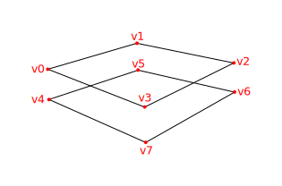
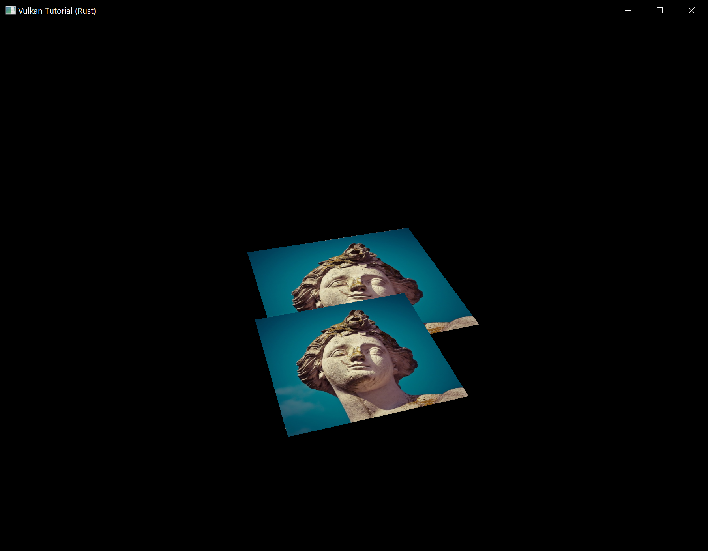
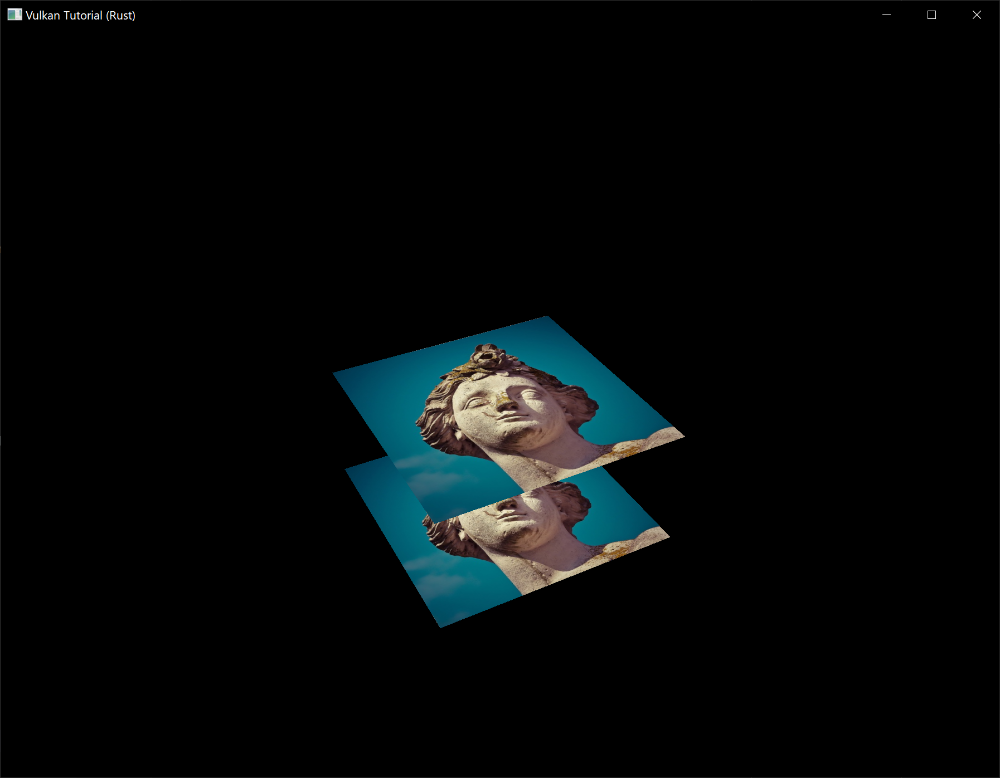

# Depth buffering

**Code:** [main.rs](https://github.com/KyleMayes/vulkanalia/tree/master/tutorial/src/26_depth_buffering.rs) | [shader.vert](https://github.com/KyleMayes/vulkanalia/tree/master/tutorial/shaders/26/shader.vert) | [shader.frag](https://github.com/KyleMayes/vulkanalia/tree/master/tutorial/shaders/26/shader.frag)

The geometry we've worked with so far is projected into 3D, but it's still completely flat. In this chapter we're going to add a Z coordinate to the position to prepare for 3D meshes. We'll use this third coordinate to place a square over the current square to see a problem that arises when geometry is not sorted by depth.

## 3D geometry

Change the `Vertex` struct to use a 3D vector for the position, and update the `format` in the corresponding `vk::VertexInputAttributeDescription` and update the offsets in the others:

```rust,noplaypen
#[repr(C)]
#[derive(Copy, Clone, Debug)]
struct Vertex {
    pos: Vec3,
    color: Vec3,
    tex_coord: Vec2,
}

impl Vertex {
    const fn new(pos: Vec3, color: Vec3, tex_coord: Vec2) -> Self {
        Self { pos, color, tex_coord }
    }

    fn binding_description() -> vk::VertexInputBindingDescription {
        vk::VertexInputBindingDescription::builder()
            .binding(0)
            .stride(size_of::<Vertex>() as u32)
            .input_rate(vk::VertexInputRate::VERTEX)
            .build()
    }

    fn attribute_descriptions() -> [vk::VertexInputAttributeDescription; 3] {
        let pos = vk::VertexInputAttributeDescription::builder()
            .binding(0)
            .location(0)
            .format(vk::Format::R32G32B32_SFLOAT)
            .offset(0)
            .build();
        let color = vk::VertexInputAttributeDescription::builder()
            .binding(0)
            .location(1)
            .format(vk::Format::R32G32B32_SFLOAT)
            .offset(size_of::<Vec3>() as u32)
            .build();
        let tex_coord = vk::VertexInputAttributeDescription::builder()
            .binding(0)
            .location(2)
            .format(vk::Format::R32G32_SFLOAT)
            .offset((size_of::<Vec3>() + size_of::<Vec3>()) as u32)
            .build();
        [pos, color, tex_coord]
    }
}
```

Next, update the vertex shader to accept and transform 3D coordinates as input. Don't forget to recompile it afterwards!

```glsl
layout(location = 0) in vec3 inPosition;

// ...

void main() {
    gl_Position = ubo.proj * ubo.view * ubo.model * vec4(inPosition, 1.0);
    fragColor = inColor;
    fragTexCoord = inTexCoord;
}
```

Lastly, update the `vertices` container to include Z coordinates:

```rust,noplaypen
static VERTICES: [Vertex; 4] = [
    Vertex::new(vec3(-0.5, -0.5, 0.0), vec3(1.0, 0.0, 0.0), vec2(1.0, 0.0)),
    Vertex::new(vec3(0.5, -0.5, 0.0), vec3(0.0, 1.0, 0.0), vec2(0.0, 0.0)),
    Vertex::new(vec3(0.5, 0.5, 0.0), vec3(0.0, 0.0, 1.0), vec2(0.0, 1.0)),
    Vertex::new(vec3(-0.5, 0.5, 0.0), vec3(1.0, 1.0, 1.0), vec2(1.0, 1.0)),
];
```

If you run your application now, then you should see exactly the same result as before. It's time to add some extra geometry to make the scene more interesting, and to demonstrate the problem that we're going to tackle in this chapter. Duplicate the vertices to define positions for a square right under the current one like this:



Use Z coordinates of `-0.5` and add the appropriate indices for the extra square:

```rust,noplaypen
static VERTICES: [Vertex; 8] = [
    Vertex::new(vec3(-0.5, -0.5, 0.0), vec3(1.0, 0.0, 0.0), vec2(1.0, 0.0)),
    Vertex::new(vec3(0.5, -0.5, 0.0), vec3(0.0, 1.0, 0.0), vec2(0.0, 0.0)),
    Vertex::new(vec3(0.5, 0.5, 0.0), vec3(0.0, 0.0, 1.0), vec2(0.0, 1.0)),
    Vertex::new(vec3(-0.5, 0.5, 0.0), vec3(1.0, 1.0, 1.0), vec2(1.0, 1.0)),
    Vertex::new(vec3(-0.5, -0.5, -0.5), vec3(1.0, 0.0, 0.0), vec2(1.0, 0.0)),
    Vertex::new(vec3(0.5, -0.5, -0.5), vec3(0.0, 1.0, 0.0), vec2(0.0, 0.0)),
    Vertex::new(vec3(0.5, 0.5, -0.5), vec3(0.0, 0.0, 1.0), vec2(0.0, 1.0)),
    Vertex::new(vec3(-0.5, 0.5, -0.5), vec3(1.0, 1.0, 1.0), vec2(1.0, 1.0)),
];

const INDICES: &[u16] = &[
    0, 1, 2, 2, 3, 0,
    4, 5, 6, 6, 7, 4,
];
```

Run your program now and you'll see something resembling an Escher illustration:



The problem is that the fragments of the lower square are drawn over the fragments of the upper square, simply because it comes later in the index array. There are two ways to solve this:

* Sort all of the draw calls by depth from back to front
* Use depth testing with a depth buffer

The first approach is commonly used for drawing transparent objects, because order-independent transparency is a difficult challenge to solve. However, the problem of ordering fragments by depth is much more commonly solved using a *depth buffer*. A depth buffer is an additional attachment that stores the depth for every position, just like the color attachment stores the color of every position. Every time the rasterizer produces a fragment, the depth test will check if the new fragment is closer than the previous one. If it isn't, then the new fragment is discarded. A fragment that passes the depth test writes its own depth to the depth buffer. It is possible to manipulate this value from the fragment shader, just like you can manipulate the color output.

Before we continue, there is one issue we need to fix. The perspective projection matrix generated by `cgmath::perspective` in `App::update_uniform_buffer` uses the OpenGL depth range of `-1.0` to `1.0`. We want to use the Vulkan range of `0.0` to `1.0` instead so we'll pre-multiply the generated perspective matrix with a [correction matrix](https://matthewwellings.com/blog/the-new-vulkan-coordinate-system) that maps the OpenGL range to the Vulkan range:

```rust,noplaypen
let correction = Mat4::new(
    1.0,  0.0,       0.0, 0.0,
    // We're also flipping the Y-axis with this line's `-1.0`.
    0.0, -1.0,       0.0, 0.0,
    0.0,  0.0, 1.0 / 2.0, 0.0,
    0.0,  0.0, 1.0 / 2.0, 0.0,
);

let proj = correction
    * cgmath::perspective(
        Deg(45.0),
        self.data.swapchain_extent.width as f32 / self.data.swapchain_extent.height as f32,
        0.1,
        10.0,
    );

// This line should be deleted because we're now accomplishing the Y-axis flip
// using the new correction matrix.
// proj[1][1] *= -1.0;
```

Note that `cgmath::Matrix4::new` constructs a matrix in column-major order, so the parameters we passed to it seem to be transposed. So the actual matrix would look like this in row-major order:

```text
1   0   0   0
0  -1   0   0
0   0   ½   ½
0   0   0   1
```

## Depth image and view

A depth attachment is based on an image, just like the color attachment. The difference is that the swapchain will not automatically create depth images for us. We only need a single depth image, because only one draw operation is running at once. The depth image will again require the trifecta of resources: image, memory and image view.

```rust,noplaypen
struct AppData {
    // ...
    depth_image: vk::Image,
    depth_image_memory: vk::DeviceMemory,
    depth_image_view: vk::ImageView,
}
```

Create a new function `create_depth_objects` to set up these resources:

```rust,noplaypen
impl App {
    unsafe fn create(window: &Window) -> Result<Self> {
        // ...
        create_command_pool(&instance, &device, &mut data)?;
        create_depth_objects(&instance, &device, &mut data)?;
        // ...
    }
}

unsafe fn create_depth_objects(
    instance: &Instance,
    device: &Device,
    data: &mut AppData,
) -> Result<()> {
    Ok(())
}
```

Creating a depth image is fairly straightforward. It should have the same resolution as the color attachment, defined by the swapchain extent, an image usage appropriate for a depth attachment, optimal tiling and device local memory. The only question is: what is the right format for a depth image? The format must contain a depth component, indicated by `D??_` in the `vk::Format` variant.

Unlike the texture image, we don't necessarily need a specific format, because we won't be directly accessing the texels from the program. It just needs to have a reasonable accuracy, at least 24 bits is common in real-world applications. There are several formats that fit this requirement:

* `vk::Format::D32_SFLOAT` &ndash; 32-bit float for depth
* `vk::Format::D32_SFLOAT_S8_UINT` &ndash; 32-bit signed float for depth and 8 bit stencil component
* `vk::Format::D24_UNORM_S8_UINT` &ndash; 24-bit float for depth and 8 bit stencil component

The stencil component is used for [stencil tests](https://en.wikipedia.org/wiki/Stencil_buffer), which is an additional test that can be combined with depth testing. We'll look at this in a future chapter.

We could simply go for the `vk::Format::D32_SFLOAT` format, because support for it is extremely common (see the hardware database), but it's nice to add some extra flexibility to our application where possible. We're going to write a `get_supported_format` function that takes a list of candidate formats in order from most desirable to least desirable and returns the first that satisfies our requirements:

```rust,noplaypen
unsafe fn get_supported_format(
    instance: &Instance,
    data: &AppData,
    candidates: &[vk::Format],
    tiling: vk::ImageTiling,
    features: vk::FormatFeatureFlags,
) -> Result<vk::Format> {
    candidates
        .iter()
        .cloned()
        .find(|f| {

        })
        .ok_or_else(|| anyhow!("Failed to find supported format!"))
}
```

The support of a format depends on the tiling mode and usage, so we must also include these as parameters. The support of a format can be queried using the `get_physical_device_format_properties` function:

```rust,noplaypen
let properties = instance.get_physical_device_format_properties(
    data.physical_device,
    *f,
);
```

The `vk::FormatProperties` struct contains three fields:

* `linear_tiling_features` &ndash; Use cases that are supported with linear tiling
* `optimal_tiling_features` &ndash; Use cases that are supported with optimal tiling
* `buffer_features` &ndash; Use cases that are supported for buffers

Only the first two are relevant here, and the one we check depends on the value provided for the `tiling` parameter of the function:

```rust,noplaypen
match tiling {
    vk::ImageTiling::LINEAR => properties.linear_tiling_features.contains(features),
    vk::ImageTiling::OPTIMAL => properties.optimal_tiling_features.contains(features),
    _ => false,
}
```

We'll use this function now to create a `get_depth_format` helper function to select a format with a depth component that supports usage as depth attachment:

```rust,noplaypen
unsafe fn get_depth_format(instance: &Instance, data: &AppData) -> Result<vk::Format> {
    let candidates = &[
        vk::Format::D32_SFLOAT,
        vk::Format::D32_SFLOAT_S8_UINT,
        vk::Format::D24_UNORM_S8_UINT,
    ];

    get_supported_format(
        instance,
        data,
        candidates,
        vk::ImageTiling::OPTIMAL,
        vk::FormatFeatureFlags::DEPTH_STENCIL_ATTACHMENT,
    )
}
```

Call the function to find a depth format from `create_depth_objects`:

```rust,noplaypen
let format = get_depth_format(instance, data)?;
```

We now have all the required information to invoke our `^create_image` and `^create_image_view` helper functions:

```rust,noplaypen
let (depth_image, depth_image_memory) = create_image(
    instance,
    device,
    data,
    data.swapchain_extent.width,
    data.swapchain_extent.height,
    format,
    vk::ImageTiling::OPTIMAL,
    vk::ImageUsageFlags::DEPTH_STENCIL_ATTACHMENT,
    vk::MemoryPropertyFlags::DEVICE_LOCAL,
)?;

data.depth_image = depth_image;
data.depth_image_memory = depth_image_memory;

// Image View

data.depth_image_view = create_image_view(device, data.depth_image, format)?;
```

However, the `^create_image_view` function currently assumes that the subresource always uses `vk::ImageAspectFlags::COLOR`, so we will need to turn that field into a parameter:

```rust,noplaypen
unsafe fn create_image_view(
    device: &Device,
    image: vk::Image,
    format: vk::Format,
    aspects: vk::ImageAspectFlags,
) -> Result<vk::ImageView> {
    let subresource_range = vk::ImageSubresourceRange::builder()
        .aspect_mask(aspects)
        .base_mip_level(0)
        .level_count(1)
        .base_array_layer(0)
        .layer_count(1);

    // ...
}
```

Update all calls to this function to use the right aspect:

```rust,noplaypen
create_image_view(device, *i, data.swapchain_format, vk::ImageAspectFlags::COLOR)

// ...

data.depth_image_view = create_image_view(
    device,
    data.depth_image,
    format,
    vk::ImageAspectFlags::DEPTH,
)?;

// ...

data.texture_image_view = create_image_view(
    device,
    data.texture_image,
    vk::Format::R8G8B8A8_SRGB,
    vk::ImageAspectFlags::COLOR,
)?;
```

That's it for creating the depth image. We don't need to map it or copy another image to it, because we're going to clear it at the start of the render pass like the color attachment.

### Explicitly transitioning the depth image

We don't need to explicitly transition the layout of the image to a depth attachment because we'll take care of this in the render pass. However, for completeness I'll still describe the process in this section. You may skip it if you like.

Make a call to `transition_image_layout` at the end of the `create_depth_objects` function like so:

```rust,noplaypen
transition_image_layout(
    device,
    data,
    data.depth_image,
    format,
    vk::ImageLayout::UNDEFINED,
    vk::ImageLayout::DEPTH_STENCIL_ATTACHMENT_OPTIMAL,
)?;
```

The undefined layout can be used as initial layout, because there are no existing depth image contents that matter. We need to update some of the logic in `transition_image_layout` to use the right subresource aspect:

```rust,noplaypen
let aspect_mask = if new_layout == vk::ImageLayout::DEPTH_STENCIL_ATTACHMENT_OPTIMAL {
    match format {
        vk::Format::D32_SFLOAT_S8_UINT | vk::Format::D24_UNORM_S8_UINT =>
            vk::ImageAspectFlags::DEPTH | vk::ImageAspectFlags::STENCIL,
        _ => vk::ImageAspectFlags::DEPTH
    }
} else {
    vk::ImageAspectFlags::COLOR
};

let subresource = vk::ImageSubresourceRange::builder()
    .aspect_mask(aspect_mask)
    .base_mip_level(0)
    .level_count(1)
    .base_array_layer(0)
    .layer_count(1);
```

Although we're not using the stencil component, we do need to include it in the layout transitions of the depth image.

Finally, add the correct access masks and pipeline stages:

```rust,noplaypen
let (
    src_access_mask,
    dst_access_mask,
    src_stage_mask,
    dst_stage_mask,
) = match (old_layout, new_layout) {
    (vk::ImageLayout::UNDEFINED, vk::ImageLayout::DEPTH_STENCIL_ATTACHMENT_OPTIMAL) => (
        vk::AccessFlags::empty(),
        vk::AccessFlags::DEPTH_STENCIL_ATTACHMENT_READ | vk::AccessFlags::DEPTH_STENCIL_ATTACHMENT_WRITE,
        vk::PipelineStageFlags::TOP_OF_PIPE,
        vk::PipelineStageFlags::EARLY_FRAGMENT_TESTS,
    ),
    // ...
};
```

The depth buffer will be read from to perform depth tests to see if a fragment is visible, and will be written to when a new fragment is drawn. The reading happens in the `vk::PipelineStageFlags::EARLY_FRAGMENT_TESTS` stage and the writing in the `vk::PipelineStageFlags::LATE_FRAGMENT_TESTS`. You should pick the earliest pipeline stage that matches the specified operations, so that it is ready for usage as depth attachment when it needs to be.

## Render pass

We're now going to modify `^create_render_pass` to include a depth attachment. First specify the `vk::AttachmentDescription`:

```rust,noplaypen
let depth_stencil_attachment = vk::AttachmentDescription::builder()
    .format(get_depth_format(instance, data)?)
    .samples(vk::SampleCountFlags::_1)
    .load_op(vk::AttachmentLoadOp::CLEAR)
    .store_op(vk::AttachmentStoreOp::DONT_CARE)
    .stencil_load_op(vk::AttachmentLoadOp::DONT_CARE)
    .stencil_store_op(vk::AttachmentStoreOp::DONT_CARE)
    .initial_layout(vk::ImageLayout::UNDEFINED)
    .final_layout(vk::ImageLayout::DEPTH_STENCIL_ATTACHMENT_OPTIMAL);
```

The `format` should be the same as the depth image itself. This time we don't care about storing the depth data (`store_op`), because it will not be used after drawing has finished. This may allow the hardware to perform additional optimizations. Just like the color buffer, we don't care about the previous depth contents, so we can use `vk::ImageLayout::UNDEFINED` as `initial_layout`.

```rust,noplaypen
let depth_stencil_attachment_ref = vk::AttachmentReference::builder()
    .attachment(1)
    .layout(vk::ImageLayout::DEPTH_STENCIL_ATTACHMENT_OPTIMAL);
```

Add a reference to the attachment for the first (and only) subpass:

```rust,noplaypen
let subpass = vk::SubpassDescription::builder()
    .pipeline_bind_point(vk::PipelineBindPoint::GRAPHICS)
    .color_attachments(color_attachments)
    .depth_stencil_attachment(&depth_stencil_attachment_ref);
```

Unlike color attachments, a subpass can only use a single depth (+stencil) attachment. It wouldn't really make any sense to do depth tests on multiple buffers.

```rust,noplaypen
let attachments = &[color_attachment, depth_stencil_attachment];
let subpasses = &[subpass];
let dependencies = &[dependency];
let info = vk::RenderPassCreateInfo::builder()
    .attachments(attachments)
    .subpasses(subpasses)
    .dependencies(dependencies);
```

Next, update the `vk::RenderPassCreateInfo` struct to refer to both attachments.

```rust,noplaypen
let dependency = vk::SubpassDependency::builder()
    .src_subpass(vk::SUBPASS_EXTERNAL)
    .dst_subpass(0)
    .src_stage_mask(vk::PipelineStageFlags::COLOR_ATTACHMENT_OUTPUT
        | vk::PipelineStageFlags::EARLY_FRAGMENT_TESTS)
    .src_access_mask(vk::AccessFlags::empty())
    .dst_stage_mask(vk::PipelineStageFlags::COLOR_ATTACHMENT_OUTPUT
        | vk::PipelineStageFlags::EARLY_FRAGMENT_TESTS)
    .dst_access_mask(vk::AccessFlags::COLOR_ATTACHMENT_WRITE
        | vk::AccessFlags::DEPTH_STENCIL_ATTACHMENT_WRITE);
```

Finally, we need to extend our subpass dependencies to make sure that there is no conflict between the transitioning of the depth image and it being cleared as part of its load operation. The depth image is first accessed in the early fragment test pipeline stage and because we have a load operation that *clears*, we should specify the access mask for writes.

## Framebuffer

The next step is to modify the framebuffer creation to bind the depth image to the depth attachment. Go to `create_framebuffers` and specify the depth image view as second attachment:

```rust,noplaypen
let attachments = &[*i, data.depth_image_view];
let create_info = vk::FramebufferCreateInfo::builder()
    .render_pass(data.render_pass)
    .attachments(attachments)
    .width(data.swapchain_extent.width)
    .height(data.swapchain_extent.height)
    .layers(1);
```

The color attachment differs for every swapchain image, but the same depth image can be used by all of them because only a single subpass is running at the same time due to our semaphores.

You'll also need to move the call to `create_framebuffers` to make sure that it is called after the depth image view has actually been created:

```rust,noplaypen
unsafe fn create(window: &Window) -> Result<Self> {
    // ...
    create_depth_objects(&instance, &device, &mut data)?;
    create_framebuffers(&device, &mut data)?;
    // ...
}
```

## Clear values

Because we now have multiple attachments with `vk::AttachmentLoadOp::CLEAR`, we also need to specify multiple clear values. Go to `create_command_buffers` and add an instance of `vk::ClearValue` to the `clear_values` array:

```rust,noplaypen
let color_clear_value = vk::ClearValue {
    color: vk::ClearColorValue {
        float32: [0.0, 0.0, 0.0, 1.0],
    },
};

let depth_clear_value = vk::ClearValue {
    depth_stencil: vk::ClearDepthStencilValue {
        depth: 1.0,
        stencil: 0,
    },
};

let clear_values = &[color_clear_value, depth_clear_value];
```

The range of depths in the depth buffer is `0.0` to `1.0` in Vulkan, where `1.0` lies at the far view plane and `0.0` at the near view plane. The initial value at each point in the depth buffer should be the furthest possible depth, which is `1.0`.

Note that the order of `clear_values` should be identical to the order of your attachments.

## Depth and stencil state

The depth attachment is ready to be used now, but depth testing still needs to be enabled in the graphics pipeline. It is configured through the `vk::PipelineDepthStencilStateCreateInfo` struct:

```rust,noplaypen
let depth_stencil_state = vk::PipelineDepthStencilStateCreateInfo::builder()
    .depth_test_enable(true)
    .depth_write_enable(true)
    // continued ...
```

The `depth_test_enable` field specifies if the depth of new fragments should be compared to the depth buffer to see if they should be discarded. The `depth_write_enable` field specifies if the new depth of fragments that pass the depth test should actually be written to the depth buffer.

```rust,noplaypen
    .depth_compare_op(vk::CompareOp::LESS)
```

The `depth_compare_op` field specifies the comparison that is performed to keep or discard fragments. We're sticking to the convention of lower depth = closer, so the depth of new fragments should be *less*.

```rust,noplaypen
    .depth_bounds_test_enable(false)
    .min_depth_bounds(0.0) // Optional.
    .max_depth_bounds(1.0) // Optional.
```

The `depth_bounds_test_enable`, `min_depth_bounds` and `max_depth_bounds` fields are used for the optional depth bound test. Basically, this allows you to only keep fragments that fall within the specified depth range. We won't be using this functionality.

```rust,noplaypen
    .stencil_test_enable(false)
    .front(/* vk::StencilOpState */) // Optional.
    .back(/* vk::StencilOpState */); // Optional.
```

The last three fields configure stencil buffer operations, which we also won't be using in this tutorial. If you want to use these operations, then you will have to make sure that the format of the depth/stencil image contains a stencil component.

```rust,noplaypen
let info = vk::GraphicsPipelineCreateInfo::builder()
    .stages(stages)
    .vertex_input_state(&vertex_input_state)
    .input_assembly_state(&input_assembly_state)
    .viewport_state(&viewport_state)
    .rasterization_state(&rasterization_state)
    .multisample_state(&multisample_state)
    .depth_stencil_state(&depth_stencil_state)
    .color_blend_state(&color_blend_state)
    .layout(data.pipeline_layout)
    .render_pass(data.render_pass)
    .subpass(0);
```

Update the `vk::GraphicsPipelineCreateInfo` struct to reference the depth stencil state we just filled in. A depth stencil state must always be specified if the render pass contains a depth stencil attachment.

If you run your program now, then you should see that the fragments of the geometry are now correctly ordered:



## Handling window resize

The resolution of the depth buffer should change when the window is resized to match the new color attachment resolution. Extend the `App::recreate_swapchain` method to recreate the depth resources in that case:

```rust,noplaypen
unsafe fn recreate_swapchain(&mut self, window: &Window) -> Result<()> {
    self.device.device_wait_idle()?;
    self.destroy_swapchain();
    create_swapchain(window, &self.instance, &self.device, &mut self.data)?;
    create_swapchain_image_views(&self.device, &mut self.data)?;
    create_render_pass(&self.instance, &self.device, &mut self.data)?;
    create_pipeline(&self.device, &mut self.data)?;
    create_depth_objects(&self.instance, &self.device, &mut self.data)?;
    create_framebuffers(&self.device, &mut self.data)?;
    create_uniform_buffers(&self.instance, &self.device, &mut self.data)?;
    create_descriptor_pool(&self.device, &mut self.data)?;
    create_descriptor_sets(&self.device, &mut self.data)?;
    create_command_buffers(&self.device, &mut self.data)?;
    Ok(())
}
```

The cleanup operations should happen in the swapchain cleanup function:

```rust,noplaypen
unsafe fn destroy_swapchain(&mut self) {
    self.device.destroy_image_view(self.data.depth_image_view, None);
    self.device.free_memory(self.data.depth_image_memory, None);
    self.device.destroy_image(self.data.depth_image, None);
    // ...
}
```

Congratulations, your application is now finally ready to render arbitrary 3D geometry and have it look right. We're going to try this out in the next chapter by drawing a textured model!
