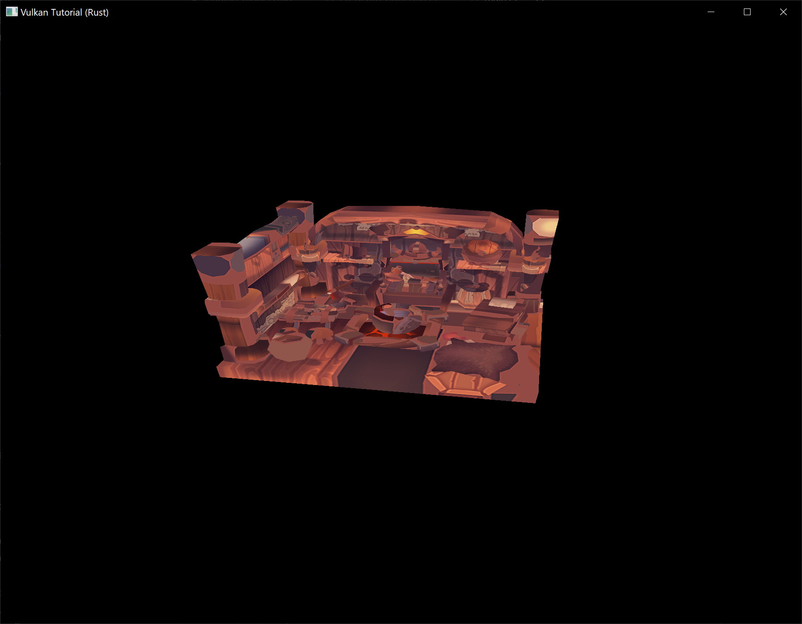
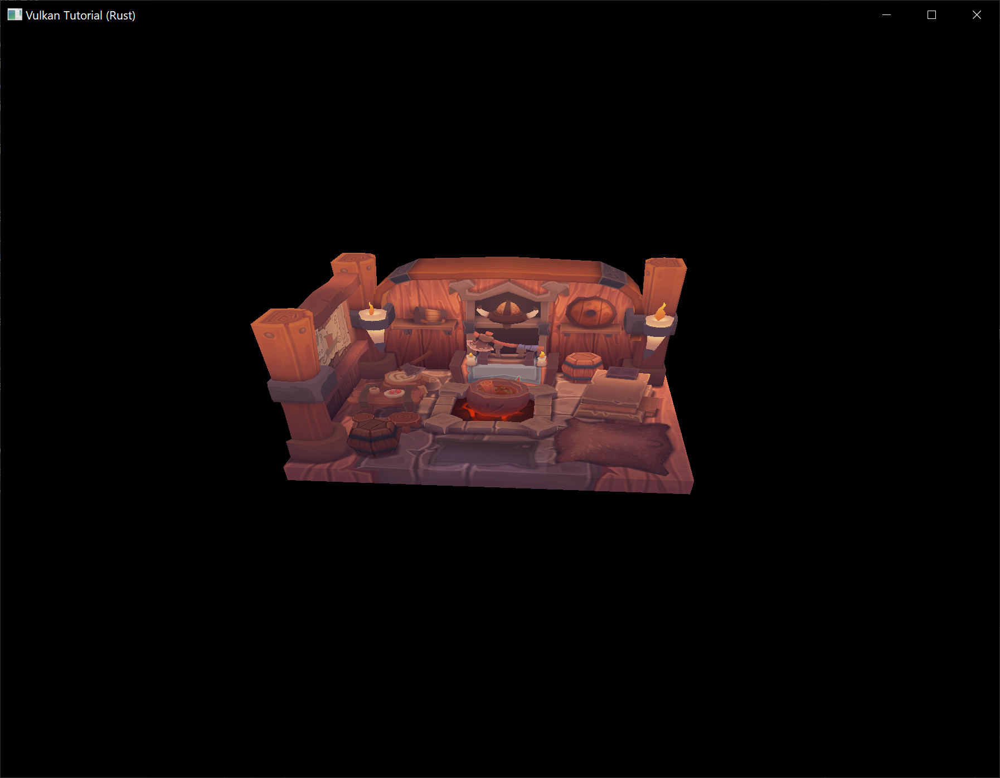

# Loading models

**Code:** [main.rs](https://github.com/KyleMayes/vulkanalia/tree/master/tutorial/src/27_model_loading.rs)

Your program is now ready to render textured 3D meshes, but the current geometry in the `vertices` and `indices` arrays is not very interesting yet. In this chapter we're going to extend the program to load the vertices and indices from an actual model file to make the graphics card actually do some work.

Many graphics API tutorials have the reader write their own OBJ loader in a chapter like this. The problem with this is that any remotely interesting 3D application will soon require features that are not supported by this file format, like skeletal animation. We *will* load mesh data from an OBJ model in this chapter, but we'll focus more on integrating the mesh data with the program itself rather than the details of loading it from a file.

## Library

We will use the [`tobj`](https://crates.io/crates/tobj) crate to load vertices and faces from an OBJ file. If you followed the instructions in the `Development environment` chapter you already have this dependency installed and ready to go.

## Sample mesh

In this chapter we won't be enabling lighting yet, so it helps to use a sample model that has lighting baked into the texture. An easy way to find such models is to look for 3D scans on [Sketchfab](https://sketchfab.com/). Many of the models on that site are available in OBJ format with a permissive license.

For this tutorial I've decided to go with the [Viking room](https://sketchfab.com/3d-models/viking-room-a49f1b8e4f5c4ecf9e1fe7d81915ad38) model by [nigelgoh](https://sketchfab.com/nigelgoh) ([CC BY 4.0](https://web.archive.org/web/20200428202538/https://sketchfab.com/3d-models/viking-room-a49f1b8e4f5c4ecf9e1fe7d81915ad38)). I tweaked the size and orientation of the model to use it as a drop in replacement for the current geometry:

* [viking_room.obj](../images/viking_room.obj)
* [viking_room.png](../images/viking_room.png)

> **Note:** The `.obj` and `.png` files that are included in this tutorial may not be identical to the original files. Make sure you use the files from this tutorial (and beyond that, the `.obj` and `.png` files may also differ from the files used in the [original C++ tutorial](https://vulkan-tutorial.com)).

Feel free to use your own model, but make sure that it only consists of one material and that is has dimensions of about 1.5 x 1.5 x 1.5 units. If it is larger than that, then you'll have to change the view matrix. Put the model file and texture image in the `resources` directory.

Update `create_texture_image` to use this path variable:

```rust,noplaypen
let image = File::open("resources/viking_room.png")?;
```

To double-check your image file is correct, you can also add this code in `create_texture_image` right after decoding the file as a PNG image:

```rust,noplaypen
if width != 1024 || height != 1024 || reader.info().color_type != png::ColorType::Rgba {
    panic!("Invalid texture image.");
}
```

## Loading vertices and indices

We're going to load the vertices and indices from the model file now, so you should remove the global `VERTICES` and `INDICES` arrays now. Replace them with `AppData` fields:

```rust,noplaypen
struct AppData {
    // ...
    vertices: Vec<Vertex>,
    indices: Vec<u32>,
    vertex_buffer: vk::Buffer,
    vertex_buffer_memory: vk::DeviceMemory,
    // ...
}
```

You'll also need to replace all the references to the global arrays with the new `AppData` fields.

You should change the type of the indices from `u16` to `u32`, because there are going to be a lot more vertices than 65,536. Remember to also change the `cmd_bind_index_buffer` parameter:

```rust,noplaypen
device.cmd_bind_index_buffer(
    *command_buffer,
    data.index_buffer,
    0,
    vk::IndexType::UINT32,
);
```

You'll also need to update the size of the index buffer in `create_index_buffer`:

```rust,noplaypen
let size = (size_of::<u32>() * data.indices.len()) as u64;
```

Next we are going to need some more imports (and we can remove the `lazy_static` import now that the global arrays have been deleted):

```rust,noplaypen
use std::collections::HashMap;
use std::hash::{Hash, Hasher};
use std::io::BufReader;
```

We're now going to write a `load_models` function that uses this library to populate the `vertices` and `indices` fields with the vertex data from the mesh. It should be called somewhere before the vertex and index buffers are created:

```rust,noplaypen
impl App {
    unsafe fn create(window: &Window) -> Result<Self> {
        // ...
        load_model(&mut data)?;
        create_vertex_buffer(&instance, &device, &mut data)?;
        create_index_buffer(&instance, &device, &mut data)?;
        // ...
    }
}

fn load_model(data: &mut AppData) -> Result<()> {
    Ok(())
}
```

A model is loaded into the crate's data structures by calling the `tobj::load_obj_buf` function:

```rust,noplaypen
let mut reader = BufReader::new(File::open("resources/viking_room.obj")?);

let (models, _) = tobj::load_obj_buf(
    &mut reader,
    &tobj::LoadOptions { triangulate: true, ..Default::default() },
    |_| Ok(Default::default()),
)?;
```

An OBJ file consists of positions, normals, texture coordinates and faces. Faces consist of an arbitrary amount of vertices, where each vertex refers to a position, normal and/or texture coordinate by index. This makes it possible to not just reuse entire vertices, but also individual attributes.

`tobj::load_obj_buf` returns a `Vec` of models and a `Vec` of materials. We are not interested in the materials, only the models, so the returned materials are ignored with `_`.

The second `tobj::load_obj_buf` parameter specifies options for processing the loaded models. The `triangulate` field we are setting to `true` ensures that the components of the loaded models are converted to triangles. This is important because our rendering code can only handle triangles. We don't need this for our Viking room model since its faces are already triangles but it might be necessary if you try using a different OBJ file.

The third `tobj::load_obj_buf` parameter is a callback used to load any materials referenced in the OBJ file. As we are not interested in the materials, we just return an empty material.

We're going to combine all of the faces in the file into a single model, so just iterate over all of the shapes:

```rust,noplaypen
for model in &models {
}
```

The triangulation feature has already made sure that there are three vertices per face, so we can now directly iterate over the vertices and dump them straight into our `vertices` vector:

```rust,noplaypen
for model in &models {
    for index in &model.mesh.indices {
        let vertex = Vertex {
            pos: glm::vec3(0.0, 0.0, 0.0),
            color: glm::vec3(1.0, 1.0, 1.0),
            tex_coord: glm::vec2(0.0, 0.0),
        };

        data.vertices.push(vertex);
        data.indices.push(data.indices.len() as u32);
    }
}
```

For simplicity, we will assume that every vertex is unique for now, hence the simple auto-increment indices. The `index` variable is used to look up the actual vertex attributes in the `positions` and `texcoords` arrays:

```rust,noplaypen
let pos_offset = (3 * index) as usize;
let tex_coord_offset = (2 * index) as usize;

let vertex = Vertex {
    pos: glm::vec3(
        model.mesh.positions[pos_offset],
        model.mesh.positions[pos_offset + 1],
        model.mesh.positions[pos_offset + 2],
    ),
    color: glm::vec3(1.0, 1.0, 1.0),
    tex_coord: glm::vec2(
        model.mesh.texcoords[tex_coord_offset],
        model.mesh.texcoords[tex_coord_offset + 1],
    ),
};
```

Unfortunately the `attrib.vertices` array is an array of `float` values instead of something like `glm::vec3`, so you need to multiply the index by `3`. Similarly, there are two texture coordinate components per entry. The offsets of `0`, `1` and `2` are used to access the X, Y and Z components, or the U and V components in the case of texture coordinates.

You may want to start compiling your program in release mode from now on because loading the texture and model can be quite slow without optimizations. If you run your program now you should see something like the following:



Great, the geometry looks correct, but what's going on with the texture? The OBJ format assumes a coordinate system where a vertical coordinate of `0` means the bottom of the image, however we've uploaded our image into Vulkan in a top to bottom orientation where `0` means the top of the image. Solve this by flipping the vertical component of the texture coordinates:

```rust,noplaypen
tex_coord: glm::vec2(
    model.mesh.texcoords[tex_coord_offset],
    1.0 - model.mesh.texcoords[tex_coord_offset + 1],
),
```

When you run your program again, you should now see the correct result:



All that hard work is finally beginning to pay off with a demo like this!

## Vertex deduplication

Unfortunately we're not really taking advantage of the index buffer yet. The `vertices` vector contains a lot of duplicated vertex data, because many vertices are included in multiple triangles. We should keep only the unique vertices and use the index buffer to reuse them whenever they come up. A straightforward way to implement this is to use a `HashMap` to keep track of the unique vertices and respective indices:

```rust,noplaypen
let mut unique_vertices = HashMap::new();

for model in &models {
    for index in &model.mesh.indices {
        // ...

        if let Some(index) = unique_vertices.get(&vertex) {
            data.indices.push(*index as u32);
        } else {
            let index = data.vertices.len();
            unique_vertices.insert(vertex, index);
            data.vertices.push(vertex);
            data.indices.push(index as u32);
        }
    }
```

Every time we read a vertex from the OBJ file, we check if we've already seen a vertex with the exact same position and texture coordinates before. If not, we add it to `vertices` and store its index in the `unique_vertices` container. After that we add the index of the new vertex to `indices`. If we've seen the exact same vertex before, then we look up its index in `unique_vertices` and store that index in `indices`.

The program will fail to compile right now because we need to implement the `Hash` trait for our `Vertex` struct to be able to use it as the key of a `HashMap`. Unfortunately since `Vertex` contains `f32`s we will need to implement `Hash` and the required traits (`PartialEq` and `Eq`) by hand (note that our `Eq` implementation is valid only as long as there aren't any `NaN`s in our vertex data which for now is a safe assumption).

```rust,noplaypen
impl PartialEq for Vertex {
    fn eq(&self, other: &Self) -> bool {
        self.pos == other.pos
            && self.color == other.color
            && self.tex_coord == other.tex_coord
    }
}

impl Eq for Vertex {}

impl Hash for Vertex {
    fn hash<H: Hasher>(&self, state: &mut H) {
        self.pos[0].to_bits().hash(state);
        self.pos[1].to_bits().hash(state);
        self.pos[2].to_bits().hash(state);
        self.color[0].to_bits().hash(state);
        self.color[1].to_bits().hash(state);
        self.color[2].to_bits().hash(state);
        self.tex_coord[0].to_bits().hash(state);
        self.tex_coord[1].to_bits().hash(state);
    }
}
```

You should now be able to successfully compile and run your program. If you check the size of `vertices`, then you'll see that it has shrunk down from 1,500,000 to 265,645! That means that each vertex is reused in an average number of ~6 triangles. This definitely saves us a lot of GPU memory.
