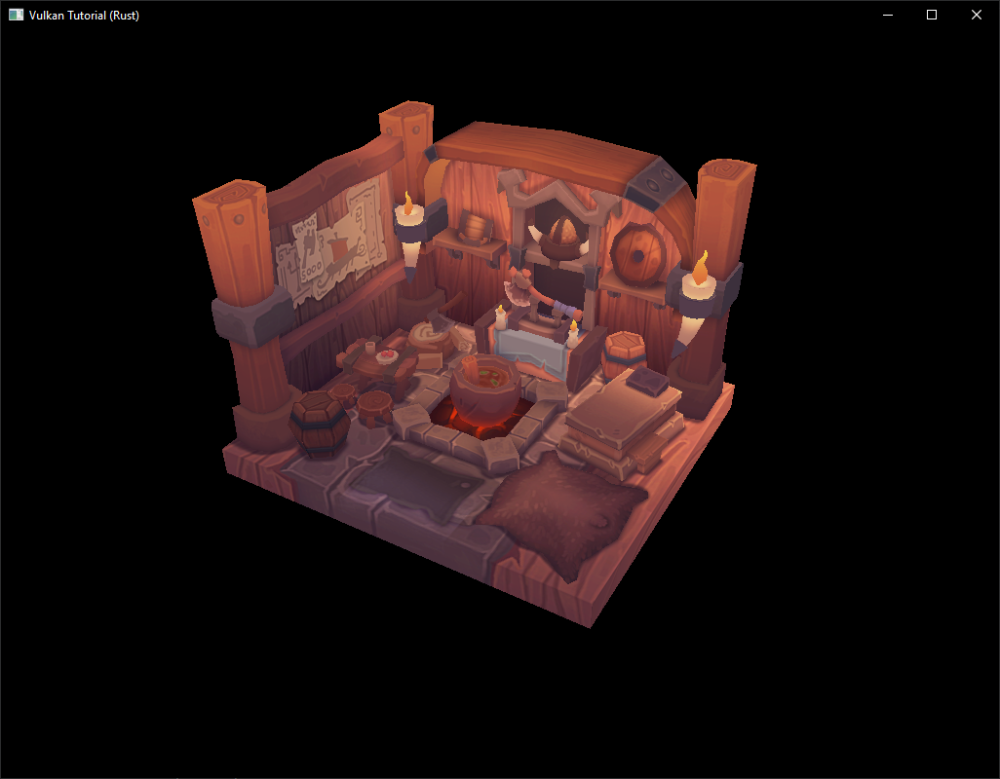
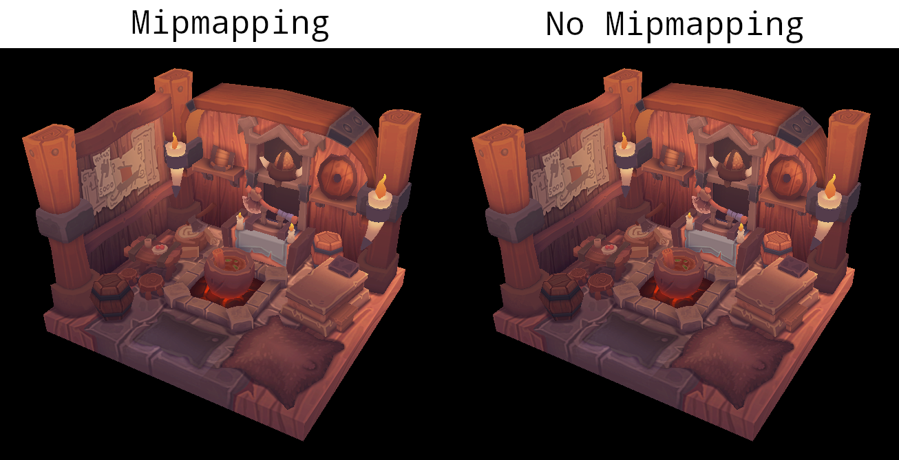

# Generating mipmaps

**Code:** [main.rs](https://github.com/KyleMayes/vulkanalia/tree/master/tutorial/src/28_mipmapping.rs)

Our program can now load and render 3D models. In this chapter, we will add one more feature, mipmap generation. Mipmaps are widely used in games and rendering software, and Vulkan gives us complete control over how they are created.

Mipmaps are precalculated, downscaled versions of an image. Each new image is half the width and height of the previous one.  Mipmaps are used as a form of *Level of Detail* or *LOD.* Objects that are far away from the camera will sample their textures from the smaller mip images. Using smaller images increases the rendering speed and avoids artifacts such as [Moiré patterns](https://en.wikipedia.org/wiki/Moir%C3%A9_pattern). An example of what mipmaps look like:


## Image creation

In Vulkan, each of the mip images is stored in different *mip levels* of a `vk::Image`. Mip level 0 is the original image, and the mip levels after level 0 are commonly referred to as the *mip chain.*

The number of mip levels is specified when the `vk::Image` is created. Up until now, we have always set this value to one. We need to calculate the number of mip levels from the dimensions of the image. First, add an `AppData` field to store this number:

```rust,noplaypen
struct AppData {
    // ...
    mip_levels: u32,
    texture_image: vk::Image,
    // ...
}
```

The value for `mip_levels` can be found once we've loaded the texture in `create_texture_image`:

```rust,noplaypen
let image = File::open("resources/viking_room.png")?;

let decoder = png::Decoder::new(image);
let mut reader = decoder.read_info()?;

// ...

data.mip_levels = (width.max(height) as f32).log2().floor() as u32 + 1;
```

This calculates the number of levels in the mip chain. The `max` method selects the largest dimension. The `log2` method calculates how many times that dimension can be divided by 2. The `floor` method handles cases where the largest dimension is not a power of 2. `1` is added so that the original image has a mip level.

To use this value, we need to change the `^create_image`, `^create_image_view`, and `transition_image_layout` functions to allow us to specify the number of mip levels. Add a `mip_levels` parameter to the functions:

```rust,noplaypen
unsafe fn create_image(
    instance: &Instance,
    device: &Device,
    data: &AppData,
    width: u32,
    height: u32,
    mip_levels: u32,
    format: vk::Format,
    tiling: vk::ImageTiling,
    usage: vk::ImageUsageFlags,
    properties: vk::MemoryPropertyFlags,
) -> Result<(vk::Image, vk::DeviceMemory)> {
    let info = vk::ImageCreateInfo::builder()
        // ...
        .mip_levels(mip_levels)
        // ...

    // ...
}
```

```rust,noplaypen
unsafe fn create_image_view(
    device: &Device,
    image: vk::Image,
    format: vk::Format,
    aspects: vk::ImageAspectFlags,
    mip_levels: u32,
) -> Result<vk::ImageView> {
    let subresource_range = vk::ImageSubresourceRange::builder()
        // ...
        .level_count(mip_levels)
        // ...

    // ...
}
```

```rust,noplaypen
unsafe fn transition_image_layout(
    device: &Device,
    data: &AppData,
    image: vk::Image,
    format: vk::Format,
    old_layout: vk::ImageLayout,
    new_layout: vk::ImageLayout,
    mip_levels: u32,
) -> Result<()> {
    // ...

    let subresource = vk::ImageSubresourceRange::builder()
        // ...
        .level_count(mip_levels)
        // ...

    // ...
}
```

Update all calls to these functions to use the right values:

> Note: Be sure to use a value of `1` for all of the images and image views except the image and image view that is for the texture.

```rust,noplaypen
let (depth_image, depth_image_memory) = create_image(
    instance,
    device,
    data,
    data.swapchain_extent.width,
    data.swapchain_extent.height,
    1,
    format,
    vk::ImageTiling::OPTIMAL,
    vk::ImageUsageFlags::DEPTH_STENCIL_ATTACHMENT,
    vk::MemoryPropertyFlags::DEVICE_LOCAL,
)?;

// ...

let (texture_image, texture_image_memory) = create_image(
    instance,
    device,
    data,
    width,
    height,
    data.mip_levels,
    vk::Format::R8G8B8A8_SRGB,
    vk::ImageTiling::OPTIMAL,
    vk::ImageUsageFlags::SAMPLED | vk::ImageUsageFlags::TRANSFER_DST,
    vk::MemoryPropertyFlags::DEVICE_LOCAL,
)?;
```

```rust,noplaypen
create_image_view(
    device,
    *i,
    data.swapchain_format,
    vk::ImageAspectFlags::COLOR,
    1,
)

// ...

data.depth_image_view = create_image_view(
    device,
    data.depth_image,
    format,
    vk::ImageAspectFlags::DEPTH,
    1,
)?;

// ...

data.texture_image_view = create_image_view(
    device,
    data.texture_image,
    vk::Format::R8G8B8A8_SRGB,
    vk::ImageAspectFlags::COLOR,
    data.mip_levels,
)?;
```

```rust,noplaypen
transition_image_layout(
    device,
    data,
    data.texture_image,
    vk::Format::R8G8B8A8_SRGB,
    vk::ImageLayout::UNDEFINED,
    vk::ImageLayout::TRANSFER_DST_OPTIMAL,
    data.mip_levels,
)?;

// ...

transition_image_layout(
    device,
    data,
    data.texture_image,
    vk::Format::R8G8B8A8_SRGB,
    vk::ImageLayout::TRANSFER_DST_OPTIMAL,
    vk::ImageLayout::SHADER_READ_ONLY_OPTIMAL,
    data.mip_levels,
)?;
```

## Generating Mipmaps

Our texture image now has multiple mip levels, but the staging buffer can only be used to fill mip level 0. The other levels are still undefined. To fill these levels we need to generate the data from the single level that we have. We will use the `cmd_blit_image` command. This command performs copying, scaling, and filtering operations. We will call this multiple times to *blit* data to each level of our texture image.

`cmd_blit_image` is considered a transfer operation, so we must inform Vulkan that we intend to use the texture image as both the source and destination of a transfer. Add `vk::ImageUsageFlags::TRANSFER_SRC` to the texture image's usage flags in `create_texture_image`:

```rust,noplaypen
let (texture_image, texture_image_memory) = create_image(
    instance,
    device,
    data,
    width,
    height,
    data.mip_levels,
    vk::Format::R8G8B8A8_SRGB,
    vk::ImageTiling::OPTIMAL,
    vk::ImageUsageFlags::SAMPLED
        | vk::ImageUsageFlags::TRANSFER_DST
        | vk::ImageUsageFlags::TRANSFER_SRC,
    vk::MemoryPropertyFlags::DEVICE_LOCAL,
)?;
```

Like other image operations, `cmd_blit_image` depends on the layout of the image it operates on. We could transition the entire image to `vk::ImageLayout::GENERAL`, but this will most likely be slow. For optimal performance, the source image should be in `vk::ImageLayout::TRANSFER_SRC_OPTIMAL` and the destination image should be in `vk::ImageLayout::TRANSFER_DST_OPTIMAL`. Vulkan allows us to transition each mip level of an image independently. Each blit will only deal with two mip levels at a time, so we can transition each level into the optimal layout between blits commands.

`transition_image_layout` only performs layout transitions on the entire image, so we'll need to write a few more pipeline barrier commands. Remove the existing transition to `vk::ImageLayout::SHADER_READ_ONLY_OPTIMAL` in `create_texture_image`.

This will leave each level of the texture image in `vk::ImageLayout::TRANSFER_DST_OPTIMAL`. Each level will be transitioned to `vk::ImageLayout::SHADER_READ_ONLY_OPTIMAL` after the blit command reading from it is finished.

We're now going to write the function that generates the mipmaps:

```rust,noplaypen
unsafe fn generate_mipmaps(
    instance: &Instance,
    device: &Device,
    data: &AppData,
    image: vk::Image,
    width: u32,
    height: u32,
    mip_levels: u32,
) -> Result<()> {
    let command_buffer = begin_single_time_commands(device, data)?;

    let subresource = vk::ImageSubresourceRange::builder()
        .aspect_mask(vk::ImageAspectFlags::COLOR)
        .base_array_layer(0)
        .layer_count(1)
        .level_count(1);

    let mut barrier = vk::ImageMemoryBarrier::builder()
        .image(image)
        .src_queue_family_index(vk::QUEUE_FAMILY_IGNORED)
        .dst_queue_family_index(vk::QUEUE_FAMILY_IGNORED)
        .subresource_range(subresource);

    end_single_time_commands(device, data, command_buffer)?;

    Ok(())
}
```

We're going to make several transitions, so we'll reuse this `vk::ImageMemoryBarrier` (which is why it is defined as mutable). The fields set above will remain the same for all barriers. `subresource_range.mip_level`, `old_layout`, `new_layout`, `src_access_mask`, and `dst_access_mask` will be changed for each transition.

```rust,noplaypen
let mut mip_width = width;
let mut mip_height = height;

for i in 1..mip_levels {
}
```

This loop will record each of the `cmd_blit_image` commands. Note that the range index starts at 1, not 0.

```rust,noplaypen
barrier.subresource_range.base_mip_level = i - 1;
barrier.old_layout = vk::ImageLayout::TRANSFER_DST_OPTIMAL;
barrier.new_layout = vk::ImageLayout::TRANSFER_SRC_OPTIMAL;
barrier.src_access_mask = vk::AccessFlags::TRANSFER_WRITE;
barrier.dst_access_mask = vk::AccessFlags::TRANSFER_READ;

device.cmd_pipeline_barrier(
    command_buffer,
    vk::PipelineStageFlags::TRANSFER,
    vk::PipelineStageFlags::TRANSFER,
    vk::DependencyFlags::empty(),
    &[] as &[vk::MemoryBarrier],
    &[] as &[vk::BufferMemoryBarrier],
    &[barrier],
);
```

First, we transition level `i - 1` to `vk::ImageLayout::TRANSFER_SRC_OPTIMAL`. This transition will wait for level `i - 1` to be filled, either from the previous blit command, or from `cmd_copy_buffer_to_image`. The current blit command will wait on this transition.

```rust,noplaypen
let src_subresource = vk::ImageSubresourceLayers::builder()
    .aspect_mask(vk::ImageAspectFlags::COLOR)
    .mip_level(i - 1)
    .base_array_layer(0)
    .layer_count(1);

let dst_subresource = vk::ImageSubresourceLayers::builder()
    .aspect_mask(vk::ImageAspectFlags::COLOR)
    .mip_level(i)
    .base_array_layer(0)
    .layer_count(1);

let blit = vk::ImageBlit::builder()
    .src_offsets([
        vk::Offset3D { x: 0, y: 0, z: 0 },
        vk::Offset3D {
            x: mip_width as i32,
            y: mip_height as i32,
            z: 1,
        },
    ])
    .src_subresource(src_subresource)
    .dst_offsets([
        vk::Offset3D { x: 0, y: 0, z: 0 },
        vk::Offset3D {
            x: (if mip_width > 1 { mip_width / 2 } else { 1 }) as i32,
            y: (if mip_height > 1 { mip_height / 2 } else { 1 }) as i32,
            z: 1,
        },
    ])
    .dst_subresource(dst_subresource);
```

Next, we specify the regions that will be used in the blit operation. The source mip level is `i - 1` and the destination mip level is `i`. The two elements of the `src_offsets` array determine the 3D region that data will be blitted from. `dst_offsets` determines the region that data will be blitted to. The X and Y dimensions of the `dst_offsets[1]` are divided by two since each mip level is half the size of the previous level. The Z dimension of `src_offsets[1]` and `dst_offsets[1]` must be 1, since a 2D image has a depth of 1.

```rust,noplaypen
device.cmd_blit_image(
    command_buffer,
    image,
    vk::ImageLayout::TRANSFER_SRC_OPTIMAL,
    image,
    vk::ImageLayout::TRANSFER_DST_OPTIMAL,
    &[blit],
    vk::Filter::LINEAR,
);
```

Now, we record the blit command. Note that `image` is used for both the `stc_image` and `dst_image` parameters. This is because we're blitting between different levels of the same image. The source mip level was just transitioned to `vk::ImageLayout::TRANSFER_SRC_OPTIMAL` and the destination level is still in `vk::ImageLayout::TRANSFER_DST_OPTIMAL` from `create_texture_image`.

Beware if you are using a dedicated transfer queue (as suggested in the `Vertex buffers` chapter): `cmd_blit_image` must be submitted to a queue with graphics capability.

The last parameter allows us to specify a `vk::Filter` to use in the blit. We have the same filtering options here that we had when making the `vk::Sampler`. We use the `vk::Filter::LINEAR` to enable interpolation.

```rust,noplaypen
barrier.old_layout = vk::ImageLayout::TRANSFER_SRC_OPTIMAL;
barrier.new_layout = vk::ImageLayout::SHADER_READ_ONLY_OPTIMAL;
barrier.src_access_mask = vk::AccessFlags::TRANSFER_READ;
barrier.dst_access_mask = vk::AccessFlags::SHADER_READ;

device.cmd_pipeline_barrier(
    command_buffer,
    vk::PipelineStageFlags::TRANSFER,
    vk::PipelineStageFlags::FRAGMENT_SHADER,
    vk::DependencyFlags::empty(),
    &[] as &[vk::MemoryBarrier],
    &[] as &[vk::BufferMemoryBarrier],
    &[barrier],
);
```

This barrier transitions mip level `i - 1` to `vk::ImageLayout::SHADER_READ_ONLY_OPTIMAL`. This transition waits on the current blit command to finish. All sampling operations will wait on this transition to finish.

```rust,noplaypen
if mip_width > 1 {
    mip_width /= 2;
}

if mip_height > 1 {
    mip_height /= 2;
}
```

At the end of the loop, we divide the current mip dimensions by two. We check each dimension before the division to ensure that dimension never becomes 0. This handles cases where the image is not square, since one of the mip dimensions would reach 1 before the other dimension. When this happens, that dimension should remain 1 for all remaining levels.

```rust,noplaypen
barrier.subresource_range.base_mip_level = mip_levels - 1;
barrier.old_layout = vk::ImageLayout::TRANSFER_DST_OPTIMAL;
barrier.new_layout = vk::ImageLayout::SHADER_READ_ONLY_OPTIMAL;
barrier.src_access_mask = vk::AccessFlags::TRANSFER_WRITE;
barrier.dst_access_mask = vk::AccessFlags::SHADER_READ;

device.cmd_pipeline_barrier(
    command_buffer,
    vk::PipelineStageFlags::TRANSFER,
    vk::PipelineStageFlags::FRAGMENT_SHADER,
    vk::DependencyFlags::empty(),
    &[] as &[vk::MemoryBarrier],
    &[] as &[vk::BufferMemoryBarrier],
    &[barrier],
);

end_single_time_commands(device, data, command_buffer)?;
```

Before we end the command buffer, we insert one more pipeline barrier. This barrier transitions the last mip level from `vk::ImageLayout::TRANSFER_DST_OPTIMAL` to `vk::ImageLayout::SHADER_READ_ONLY_OPTIMAL`. This wasn't handled by the loop, since the last mip level is never blitted from.

Finally, add the call to `generate_mipmaps` at the end of `create_texture_image`:

```rust,noplaypen
generate_mipmaps(
    instance,
    device,
    data,
    data.texture_image,
    width,
    height,
    data.mip_levels,
)?;
```

Our texture image's mipmaps are now completely filled.

## Linear filtering support

It is very convenient to use a built-in command like `cmd_blit_image` to generate all the mip levels, but unfortunately it is not guaranteed to be supported on all platforms. It requires the texture image format we use to support linear filtering, which can be checked with the `get_physical_device_format_properties` command. We will add a check to the `generate_mipmaps` function for this.

First add an additional parameter that specifies the image format:

```rust,noplaypen
generate_mipmaps(
    instance,
    device,
    data,
    data.texture_image,
    vk::Format::R8G8B8A8_SRGB,
    width,
    height,
    data.mip_levels,
)?;

// ...

unsafe fn generate_mipmaps(
    instance: &Instance,
    device: &Device,
    data: &AppData,
    image: vk::Image,
    format: vk::Format,
    width: u32,
    height: u32,
    mip_levels: u32,
) -> Result<()> {
    // ...
}
```

In the `generate_mipmaps` function, use `get_physical_device_format_properties` to request the properties of the texture image format and check that linear filtering is supported:

```rust,noplaypen
if !instance
    .get_physical_device_format_properties(data.physical_device, format)
    .optimal_tiling_features
    .contains(vk::FormatFeatureFlags::SAMPLED_IMAGE_FILTER_LINEAR)
{
    return Err(anyhow!("Texture image format does not support linear blitting!"));
}
```

The `vk::FormatProperties` struct has three fields named `linear_tiling_features`, `optimal_tiling_features`, and `buffer_features` that each describe how the format can be used depending on the way it is used. We create a texture image with the optimal tiling format, so we need to check `optimal_tiling_features`. Support for the linear filtering feature can be checked with `vk::FormatFeatureFlags::SAMPLED_IMAGE_FILTER_LINEAR`.

There are two alternatives in the case where this is not supported. You could implement a function that searches common texture image formats for one that *does* support linear blitting, or you could implement the mipmap generation in your software. Each mip level can then be loaded into the image in the same way that you loaded the original image.

It should be noted that it is uncommon in practice to generate the mipmap levels at runtime anyway. Usually they are pregenerated and stored in the texture file alongside the base level to improve loading speed. Implementing resizing in software and loading multiple levels from a file is left as an exercise to the reader.

## Sampler

While the `vk::Image` holds the mipmap data, `vk::Sampler` controls how that data is read while rendering. Vulkan allows us to specify `min_lod`, `max_lod`, `mip_lod_bias`, and `mipmap_mode` ("LOD" means "Level of Detail"). When a texture is sampled, the sampler selects a mip level according to the following pseudocode:

```rust,noplaypen
// Smaller when the object is close, may be negative.
let mut lod = get_lod_level_from_screen_size();

lod = clamp(lod + mip_lod_bias, min_lop, max_lod);

// Clamped to the number of mip levels in the texture.
let level = clamp(floor(lod), 0, texture.mip_levels - 1);

let color = if mipmap_mode == vk::SamplerMipmapMode::NEAREST {
    sample(level)
} else {
    blend(sample(level), sample(level + 1))
};
```

If `sampler_info.mipmap_mode` is `vk::SamplerMipmapMode::NEAREST`, `lod` selects the mip level to sample from. If the mipmap mode is `vk::SamplerMipmapMode::LINEAR`, `lod` is used to select two mip levels to be sampled. Those levels are sampled and the results are linearly blended.

The sample operation is also affected by `lod`:

```rust,noplaypen
let color = if lod <= 0 {
    read_texture(uv, mag_filter)
} else {
    read_texture(uv, min_filter)
};
```

If the object is close to the camera, `mag_filter` is used as the filter. If the object is further from the camera, `min_filter` is used. Normally, `lod` is non-negative, and is only 0 when close the camera. `mip_lod_bias` lets us force Vulkan to use lower `lod` and `level` than it would normally use.

To see the results of this chapter, we need to choose values for our `texture_sampler`. We've already set the `min_filter` and `mag_filter` to use `vk::Filter::LINEAR`. We just need to choose values for `min_lod`, `max_lod`, `mip_lod_bias`, and `mipmap_mode`.

```rust,noplaypen
unsafe fn create_texture_sampler(device: &Device, data: &mut AppData) -> Result<()> {
    let info = vk::SamplerCreateInfo::builder()
        // ...
        .mipmap_mode(vk::SamplerMipmapMode::LINEAR)
        .min_lod(0.0)       // Optional.
        .max_lod(data.mip_levels as f32)
        .mip_lod_bias(0.0); // Optional.

    data.texture_sampler = device.create_sampler(&info, None)?;

    Ok(())
}
```

To allow the full range of mip levels to be used, we set `min_lod` to `0.0` and `max_lod` to the number of mip levels. We have no reason to change the `lod` value, so we set `mip_lod_bias` to 0.0f.

Now run your program and you should see the following:



It's not a dramatic difference, since our scene is so simple. There are subtle differences if you look closely (it will be much easier to spot differences if you open the below image in a separate tab so you can see it at full size).



One of most noticeable differences is the axe head. With mipmaps, the borders between the dark gray and light gray areas have been smoothed. Without mipmaps, these borders are much sharper. The differences are clear in this image which shows the axe head with and without mipmapping at 8x magnification (without any filtering so the pixels are simply expanded).


You can play around with the sampler settings to see how they affect mipmapping. For example, by changing `min_lod`, you can force the sampler to not use the lowest mip levels:

```rust,noplaypen
.min_lod(data.mip_levels as f32 / 2.0)
```

These settings will produce this image:


This is how higher mip levels will be used when objects are further away from the camera.
