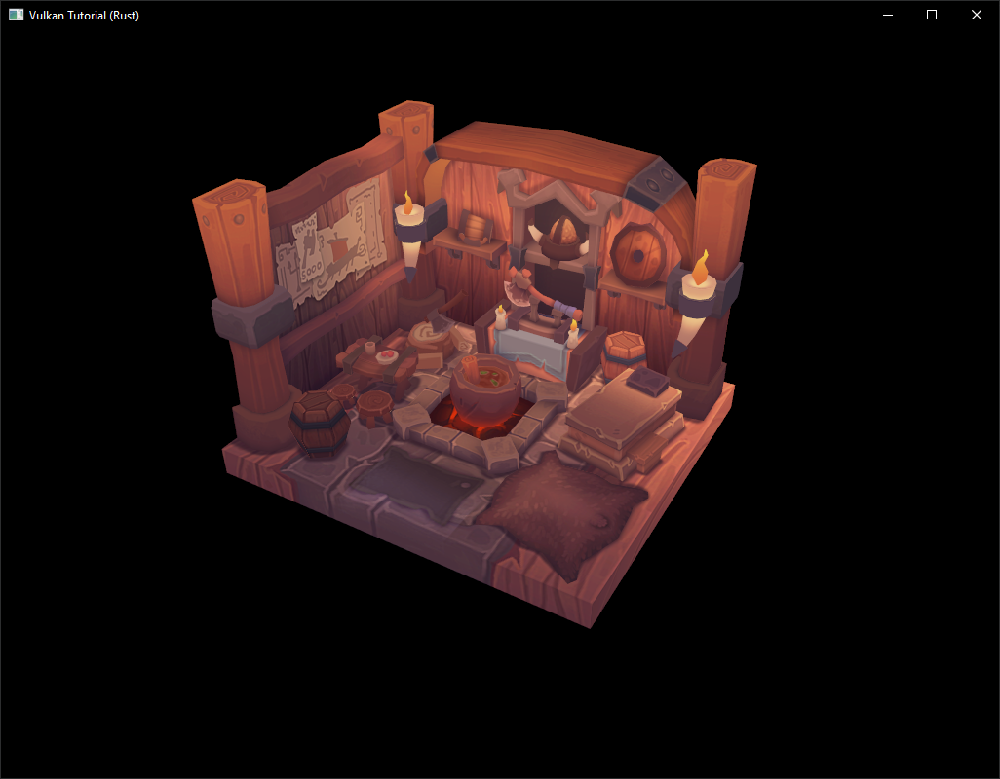
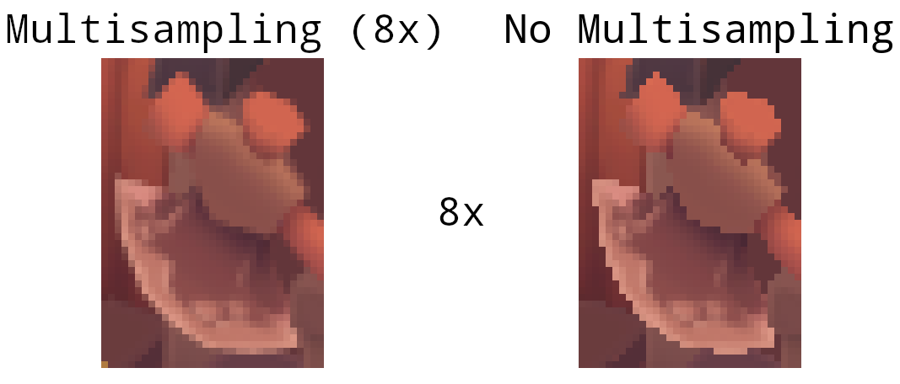

# Multisampling

**Code:** [main.rs](https://github.com/KyleMayes/vulkanalia/tree/master/tutorial/src/29_multisampling.rs)

Our program can now load multiple levels of detail for textures which fixes artifacts when rendering objects far away from the viewer. The image is now a lot smoother, however on closer inspection you will notice jagged saw-like patterns along the edges of drawn geometric shapes. This is visible in one of our early programs when we rendered a quad:


This undesired effect is called "aliasing" and it's a result of a limited numbers of pixels that are available for rendering. Since there are no displays out there with unlimited resolution, it will be always visible to some extent. There's a number of ways to fix this and in this chapter we'll focus on one of the more popular ones: [multisample anti-aliasing](https://en.wikipedia.org/wiki/Multisample_anti-aliasing) (MSAA).

In ordinary rendering, the pixel color is determined based on a single sample point which in most cases is the center of the target pixel on screen. If part of the drawn line passes through a certain pixel but doesn't cover the sample point, that pixel will be left blank, leading to the jagged "staircase" effect.


What MSAA does is it uses multiple sample points per pixel (hence the name) to determine its final color. As one might expect, more samples lead to better results, however it is also more computationally expensive.


In our implementation, we will focus on using the maximum available sample count. Depending on your application this may not always be the best approach and it might be better to use less samples for the sake of higher performance if the final result meets your quality demands.


## Getting available sample count

Let's start off by determining how many samples our hardware can use. Most modern GPUs support at least 8 samples but this number is not guaranteed to be the same everywhere. We'll keep track of it by adding a new field to `AppData`:

```rust,noplaypen
struct AppData {
    // ...
    physical_device: vk::PhysicalDevice,
    msaa_samples: vk::SampleCountFlags,
    // ...
}
```

By default we'll be using only one sample per pixel which is equivalent to no multisampling, in which case the final image will remain unchanged. The exact maximum number of samples can be extracted from `vk::PhysicalDeviceProperties` associated with our selected physical device. We're using a depth buffer, so we have to take into account the sample count for both color and depth. The highest sample count that is supported by both (&) will be the maximum we can support. Add a function that will fetch this information for us:

```rust,noplaypen
unsafe fn get_max_msaa_samples(
    instance: &Instance,
    data: &AppData,
) -> vk::SampleCountFlags {
    let properties = instance.get_physical_device_properties(data.physical_device);
    let counts = properties.limits.framebuffer_color_sample_counts
        & properties.limits.framebuffer_depth_sample_counts;
    [
        vk::SampleCountFlags::_64,
        vk::SampleCountFlags::_32,
        vk::SampleCountFlags::_16,
        vk::SampleCountFlags::_8,
        vk::SampleCountFlags::_4,
        vk::SampleCountFlags::_2,
    ]
    .iter()
    .cloned()
    .find(|c| counts.contains(*c))
    .unwrap_or(vk::SampleCountFlags::_1)
}
```

We will now use this function to set the `msaa_samples` variable during the physical device selection process. For this, we have to slightly modify the `pick_physical_device` function to set the maximum MSAA samples after selecting a physical device:

```rust,noplaypen
unsafe fn pick_physical_device(instance: &Instance, data: &mut AppData) -> Result<()> {
    // ...

    for physical_device in instance.enumerate_physical_devices()? {
        // ...

        if let Err(error) = check_physical_device(instance, data, physical_device) {
            // ...
        } else {
            // ...
            data.msaa_samples = get_max_msaa_samples(instance, data);
            return Ok(());
        }
    }

    Ok(())
}
```

## Setting up a render target

In MSAA, each pixel is sampled in an offscreen buffer which is then rendered to the screen. This new buffer is slightly different from regular images we've been rendering to - they have to be able to store more than one sample per pixel. Once a multisampled buffer is created, it has to be resolved to the default framebuffer (which stores only a single sample per pixel). This is why we have to create an additional render target and modify our current drawing process. We only need one render target since only one drawing operation is active at a time, just like with the depth buffer. Add the following `AppData` fields:

```rust,noplaypen
struct AppData {
    // ...
    color_image: vk::Image,
    color_image_memory: vk::DeviceMemory,
    color_image_view: vk::ImageView,
    // ...
}
```

This new image will have to store the desired number of samples per pixel, so we need to pass this number to `vk::ImageCreateInfo` during the image creation process. Modify the `^create_image` function by adding a `samples` parameter:

```rust,noplaypen
unsafe fn create_image(
    instance: &Instance,
    device: &Device,
    data: &AppData,
    width: u32,
    height: u32,
    mip_levels: u32,
    samples: vk::SampleCountFlags,
    format: vk::Format,
    tiling: vk::ImageTiling,
    usage: vk::ImageUsageFlags,
    properties: vk::MemoryPropertyFlags,
) -> Result<(vk::Image, vk::DeviceMemory)> {
    // Image

    let info = vk::ImageCreateInfo::builder()
        // ...
        .samples(samples)
        // ...

    // ...
}
```

For now, update all calls to this function using `vk::SampleCountFlags::_1` - we will be replacing this with proper values as we progress with implementation:

```rust,noplaypen
let (depth_image, depth_image_memory) = create_image(
    instance,
    device,
    data,
    data.swapchain_extent.width,
    data.swapchain_extent.height,
    1,
    vk::SampleCountFlags::_1,
    format,
    vk::ImageTiling::OPTIMAL,
    vk::ImageUsageFlags::DEPTH_STENCIL_ATTACHMENT,
    vk::MemoryPropertyFlags::DEVICE_LOCAL,
)?;

// ...

let (texture_image, texture_image_memory) = create_image(
    instance,
    device,
    data,
    width,
    height,
    data.mip_levels,
    vk::SampleCountFlags::_1,
    vk::Format::R8G8B8A8_SRGB,
    vk::ImageTiling::OPTIMAL,
    vk::ImageUsageFlags::SAMPLED
        | vk::ImageUsageFlags::TRANSFER_DST
        | vk::ImageUsageFlags::TRANSFER_SRC,
    vk::MemoryPropertyFlags::DEVICE_LOCAL,
)?;
```

We will now create a multisampled color buffer. Add a `create_color_objects` function and note that we're using `msaaSamples` here as a function parameter to `createImage`. We're also using only one mip level, since this is enforced by the Vulkan specification in case of images with more than one sample per pixel. Also, this color buffer doesn't need mipmaps since it's not going to be used as a texture:

```rust,noplaypen
unsafe fn create_color_objects(
    instance: &Instance,
    device: &Device,
    data: &mut AppData,
) -> Result<()> {
    let (color_image, color_image_memory) = create_image(
        instance,
        device,
        data,
        data.swapchain_extent.width,
        data.swapchain_extent.height,
        1,
        data.msaa_samples,
        data.swapchain_format,
        vk::ImageTiling::OPTIMAL,
        vk::ImageUsageFlags::COLOR_ATTACHMENT
            | vk::ImageUsageFlags::TRANSIENT_ATTACHMENT,
        vk::MemoryPropertyFlags::DEVICE_LOCAL,
    )?;

    data.color_image = color_image;
    data.color_image_memory = color_image_memory;

    data.color_image_view = create_image_view(
        device,
        data.color_image,
        data.swapchain_format,
        vk::ImageAspectFlags::COLOR,
        1,
    )?;

    Ok(())
}
```

For consistency, call the function right before `create_depth_objects`:

```rust,noplaypen
unsafe fn create(window: &Window) -> Result<Self> {
    // ...
    create_color_objects(&instance, &device, &mut data)?;
    create_depth_objects(&instance, &device, &mut data)?;
    // ...
}
```

Now that we have a multisampled color buffer in place it's time to take care of depth. Modify `create_depth_objects` and update the number of samples used by the depth buffer:

```rust,noplaypen
unsafe fn create_depth_objects(
    instance: &Instance,
    device: &Device,
    data: &mut AppData,
) -> Result<()> {
    // ...

    let (depth_image, depth_image_memory) = create_image(
        instance,
        device,
        data,
        data.swapchain_extent.width,
        data.swapchain_extent.height,
        1,
        data.msaa_samples,
        format,
        vk::ImageTiling::OPTIMAL,
        vk::ImageUsageFlags::DEPTH_STENCIL_ATTACHMENT,
        vk::MemoryPropertyFlags::DEVICE_LOCAL,
    )?;

    // ...
}
```

We have now created a couple of new Vulkan resources, so let's not forget to release them when necessary:

```rust,noplaypen
unsafe fn destroy_swapchain(&mut self) {
    self.device.destroy_image_view(self.data.color_image_view, None);
    self.device.free_memory(self.data.color_image_memory, None);
    self.device.destroy_image(self.data.color_image, None);
    // ...
}
```

And update the `App::recreate_swapchain` method so that the new color image can be recreated in the correct resolution when the window is resized:

```rust,noplaypen
unsafe fn recreate_swapchain(&mut self, window: &Window) -> Result<()> {
    // ...
    create_color_objects(&self.instance, &self.device, &mut self.data)?;
    create_depth_objects(&self.instance, &self.device, &mut self.data)?;
    // ...
}
```

We made it past the initial MSAA setup, now we need to start using this new resource in our graphics pipeline, framebuffer, render pass and see the results!

## Adding new attachments

Let's take care of the render pass first. Modify `^create_render_pass` and update color and depth attachment creation info structs:

```rust,noplaypen
unsafe fn create_render_pass(
    instance: &Instance,
    device: &Device,
    data: &mut AppData,
) -> Result<()> {
    let color_attachment = vk::AttachmentDescription::builder()
        // ...
        .samples(data.msaa_samples)
        // ...
        .final_layout(vk::ImageLayout::COLOR_ATTACHMENT_OPTIMAL);

    let depth_stencil_attachment = vk::AttachmentDescription::builder()
        // ...
        .samples(data.msaa_samples)
        // ...

    // ...
}
```

You'll notice that we have changed the finalLayout from `vk::ImageLayout::PRESENT_SRC_KHR` to `vk::ImageLayout::COLOR_ATTACHMENT_OPTIMAL`. That's because multisampled images cannot be presented directly. We first need to resolve them to a regular image. This requirement does not apply to the depth buffer, since it won't be presented at any point. Therefore we will have to add only one new attachment for color which is a so-called resolve attachment:

```rust,noplaypen
let color_resolve_attachment = vk::AttachmentDescription::builder()
    .format(data.swapchain_format)
    .samples(vk::SampleCountFlags::_1)
    .load_op(vk::AttachmentLoadOp::DONT_CARE)
    .store_op(vk::AttachmentStoreOp::STORE)
    .stencil_load_op(vk::AttachmentLoadOp::DONT_CARE)
    .stencil_store_op(vk::AttachmentStoreOp::DONT_CARE)
    .initial_layout(vk::ImageLayout::UNDEFINED)
    .final_layout(vk::ImageLayout::PRESENT_SRC_KHR);
```

The render pass now has to be instructed to resolve multisampled color image into regular attachment. Create a new attachment reference that will point to the color buffer which will serve as the resolve target:

```rust,noplaypen
let color_resolve_attachment_ref = vk::AttachmentReference::builder()
    .attachment(2)
    .layout(vk::ImageLayout::COLOR_ATTACHMENT_OPTIMAL);
```

Set the `resolve_attachments` subpass struct member to point to the newly created attachment reference. This is enough to let the render pass define a multisample resolve operation which will let us render the image to screen:

```rust,noplaypen
let color_attachments = &[color_attachment_ref];
let resolve_attachments = &[color_resolve_attachment_ref];
let subpass = vk::SubpassDescription::builder()
    .pipeline_bind_point(vk::PipelineBindPoint::GRAPHICS)
    .color_attachments(color_attachments)
    .depth_stencil_attachment(&depth_stencil_attachment_ref)
    .resolve_attachments(resolve_attachments);
```

Now update render pass info struct with the new color attachment:

```rust,noplaypen
let attachments = &[
    color_attachment,
    depth_stencil_attachment,
    color_resolve_attachment,
];
let subpasses = &[subpass];
let dependencies = &[dependency];
let info = vk::RenderPassCreateInfo::builder()
    .attachments(attachments)
    .subpasses(subpasses)
    .dependencies(dependencies);
```

With the render pass in place, modify `create_framebuffers` and add the new image view to the attachments slice:

```rust,noplaypen
let attachments = &[data.color_image_view, data.depth_image_view, *i];
```

Finally, tell the newly created pipeline to use more than one sample by modifying `^create_pipeline`:

```rust,noplaypen
let multisample_state = vk::PipelineMultisampleStateCreateInfo::builder()
    .sample_shading_enable(false)
    .rasterization_samples(data.msaa_samples);
```

Now run your program and you should see the following:



Just like with mipmapping, the difference may not be apparent straight away. On a closer look you'll notice that the edges are not as jagged anymore and the whole image seems a bit smoother compared to the original (again it will be much easier to spot differences if you open the below image in a separate tab).


The difference is more noticeable when taking another close look at the axe head at 8x magnification:



## Quality improvements

There are certain limitations of our current MSAA implementation which may impact the quality of the output image in more detailed scenes. For example, we're currently not solving potential problems caused by shader aliasing, i.e. MSAA only smoothens out the edges of geometry but not the interior filling. This may lead to a situation when you get a smooth polygon rendered on screen but the applied texture will still look aliased if it contains high contrasting colors. One way to approach this problem is to enable [Sample Shading](https://www.khronos.org/registry/vulkan/specs/1.0/html/vkspec.html#primsrast-sampleshading) which will improve the image quality even further, though at an additional performance cost:

```rust,noplaypen
unsafe fn create_logical_device(
    instance: &Instance,
    data: &mut AppData,
) -> Result<Device> {
    // ...

    let features = vk::PhysicalDeviceFeatures::builder()
        .sampler_anisotropy(true)
        // Enable sample shading feature for the device.
        .sample_rate_shading(true);

    // ...
}

// ...

unsafe fn create_pipeline(device: &Device, data: &mut AppData) -> Result<()> {
    // ...

    let multisample_state = vk::PipelineMultisampleStateCreateInfo::builder()
        // Enable sample shading in the pipeline.
        .sample_shading_enable(true)
        // Minimum fraction for sample shading; closer to one is smoother.
        .min_sample_shading(0.2)
        .rasterization_samples(data.msaa_samples);

    // ...
}
```

In this example we'll leave sample shading disabled but in certain scenarios the quality improvement may be noticeable:


