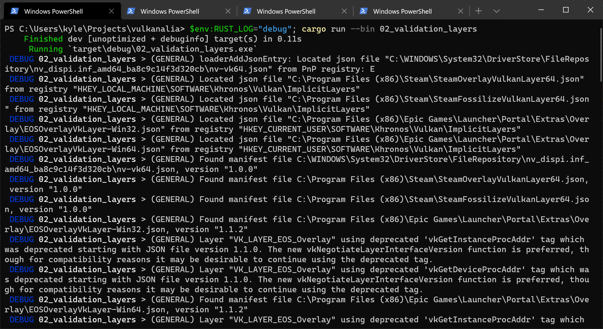

# Validation layers

**Code:** [main.rs](https://github.com/KyleMayes/vulkanalia/tree/master/tutorial/src/02_validation_layers.rs)

The Vulkan API is designed around the idea of minimal driver overhead and one of the manifestations of that goal is that there is very limited error checking in the API by default. Even mistakes as simple as setting enumerations to incorrect values are generally not explicitly handled and will simply result in crashes or undefined behavior. Because Vulkan requires you to be very explicit about everything you're doing, it's easy to make many small mistakes like using a new GPU feature and forgetting to request it at logical device creation time.

However, that doesn't mean that these checks can't be added to the API. Vulkan introduces an elegant system for this known as validation layers. Validation layers are optional components that hook into Vulkan function calls to apply additional operations. Common operations in validation layers are:

* Checking the values of parameters against the specification to detect misuse
* Tracking creation and destruction of objects to find resource leaks
* Checking thread safety by tracking the threads that calls originate from
* Logging every call and its parameters to the standard output
* Tracing Vulkan calls for profiling and replaying

Here's an example of what the implementation of a function in a diagnostics validation layer could look like (in C):

```c
VkResult vkCreateInstance(
    const VkInstanceCreateInfo* pCreateInfo,
    const VkAllocationCallbacks* pAllocator,
    VkInstance* instance
) {
    if (pCreateInfo == nullptr || instance == nullptr) {
        log("Null pointer passed to required parameter!");
        return VK_ERROR_INITIALIZATION_FAILED;
    }

    return real_vkCreateInstance(pCreateInfo, pAllocator, instance);
}
```

These validation layers can be freely stacked to include all the debugging functionality that you're interested in. You can simply enable validation layers for debug builds and completely disable them for release builds, which gives you the best of both worlds!

Vulkan does not come with any validation layers built-in, but the LunarG Vulkan SDK provides a nice set of layers that check for common errors. They're also completely [open source](https://github.com/KhronosGroup/Vulkan-ValidationLayers), so you can check which kind of mistakes they check for and contribute. Using the validation layers is the best way to avoid your application breaking on different drivers by accidentally relying on undefined behavior.

Validation layers can only be used if they have been installed onto the system. For example, the LunarG validation layers are only available on PCs with the Vulkan SDK installed.

There were formerly two different types of validation layers in Vulkan: instance and device specific. The idea was that instance layers would only check calls related to global Vulkan objects like instances, and device specific layers would only check calls related to a specific GPU. Device specific layers have now been deprecated, which means that instance validation layers apply to all Vulkan calls. The specification document still recommends that you enable validation layers at device level as well for compatibility, which is required by some implementations. We'll simply specify the same layers as the instance at logical device level, which we'll see later on.

Before we get started, we'll need some new imports for this chapter:

```rust,noplaypen
use std::collections::HashSet;
use std::ffi::CStr;
use std::os::raw::c_void;

use vulkanalia::vk::ExtDebugUtilsExtension;
```

`HashSet` will be used for storing and querying supported layers and the other imports will be used in the function we will be writing to log messages from the validation layer with the exception of `vk::ExtDebugUtilsExtension` which provides the command wrappers for managing debugging functionality.

## Using validation layers

In this section we'll see how to enable the standard diagnostics layers provided by the Vulkan SDK. Just like extensions, validation layers need to be enabled by specifying their name. All of the useful standard validation is bundled into a layer included in the SDK that is known as `VK_LAYER_KHRONOS_validation`.

Let's first add two configuration variables to the program to specify the layers to enable and whether to enable them or not. I've chosen to base that value on whether the program is being compiled in debug mode or not.

```rust,noplaypen
const VALIDATION_ENABLED: bool =
    cfg!(debug_assertions);

const VALIDATION_LAYER: vk::ExtensionName =
    vk::ExtensionName::from_bytes(b"VK_LAYER_KHRONOS_validation");
```

We'll add some new code to our `^create_instance` function that collects the supported instance layers into a `HashSet`, checks that the validation layer is available, and creates a list of layer names containing the validation layer. This code should go right below where the `vk::ApplicationInfo` struct is built:

```rust,noplaypen
let available_layers = entry
    .enumerate_instance_layer_properties()?
    .iter()
    .map(|l| l.layer_name)
    .collect::<HashSet<_>>();

if VALIDATION_ENABLED && !available_layers.contains(&VALIDATION_LAYER) {
    return Err(anyhow!("Validation layer requested but not supported."));
}

let layers = if VALIDATION_ENABLED {
    vec![VALIDATION_LAYER.as_ptr()]
} else {
    Vec::new()
};
```

Then you'll need to specify the requested layers in `vk::InstanceCreateInfo` by adding a call to the `enabled_layer_names` builder method:

```rust,noplaypen
let info = vk::InstanceCreateInfo::builder()
    .application_info(&application_info)
    .enabled_layer_names(&layers)
    .enabled_extension_names(&extensions)
    .flags(flags);
```

Now run the program in debug mode and ensure that the `Validation layer requested but not supported.` error does not occur. If it does, then have a look at the FAQ. If you get past that check, then `create_instance` should never return a `vk::ErrorCode::LAYER_NOT_PRESENT` error code but you should still run the program to be sure.

## Message callback

The validation layers will print debug messages to the standard output by default, but we can also handle them ourselves by providing an explicit callback in our program. This will also allow you to decide which kind of messages you would like to see, because not all are necessarily (fatal) errors. If you don't want to do that right now then you may skip to the last section in this chapter.

To set up a callback in the program to handle messages and the associated details, we have to set up a debug messenger with a callback using the `VK_EXT_debug_utils` extension.

We'll add some more code to our `^create_instance` function. This time we'll modify the `extensions` list to be mutable and then add the debug utilities extension to the list when the validation layer is enabled:

```rust,noplaypen
let mut extensions = vk_window::get_required_instance_extensions(window)
    .iter()
    .map(|e| e.as_ptr())
    .collect::<Vec<_>>();

if VALIDATION_ENABLED {
    extensions.push(vk::EXT_DEBUG_UTILS_EXTENSION.name.as_ptr());
}
```

`vulkanalia` provides a collection of metadata for each Vulkan extension. In this case we just need the name of the extension to load, so we add the value of the `name` field of the `vk::EXT_DEBUG_UTILS_EXTENSION` struct constant to our list of desired extension names.

Run the program to make sure you don't receive a `vk::ErrorCode::EXTENSION_NOT_PRESENT` error code. We don't really need to check for the existence of this extension, because it should be implied by the availability of the validation layers.

Now let's see what a debug callback function looks like. Add a new `extern "system"` function called `debug_callback` that matches the `vk::PFN_vkDebugUtilsMessengerCallbackEXT` prototype. The `extern "system"` is necessary to allow Vulkan to call our Rust function.

```rust,noplaypen
extern "system" fn debug_callback(
    severity: vk::DebugUtilsMessageSeverityFlagsEXT,
    type_: vk::DebugUtilsMessageTypeFlagsEXT,
    data: *const vk::DebugUtilsMessengerCallbackDataEXT,
    _: *mut c_void,
) -> vk::Bool32 {
    let data = unsafe { *data };
    let message = unsafe { CStr::from_ptr(data.message) }.to_string_lossy();

    if severity >= vk::DebugUtilsMessageSeverityFlagsEXT::ERROR {
        error!("({:?}) {}", type_, message);
    } else if severity >= vk::DebugUtilsMessageSeverityFlagsEXT::WARNING {
        warn!("({:?}) {}", type_, message);
    } else if severity >= vk::DebugUtilsMessageSeverityFlagsEXT::INFO {
        debug!("({:?}) {}", type_, message);
    } else {
        trace!("({:?}) {}", type_, message);
    }

    vk::FALSE
}
```

The first parameter specifies the severity of the message, which is one of the following flags:

* `vk::DebugUtilsMessageSeverityFlagsEXT::VERBOSE` &ndash; Diagnostic message
* `vk::DebugUtilsMessageSeverityFlagsEXT::INFO` &ndash; Informational message like the creation of a resource
* `vk::DebugUtilsMessageSeverityFlagsEXT::WARNING` &ndash; Message about behavior that is not necessarily an error, but very likely a bug in your application
* `vk::DebugUtilsMessageSeverityFlagsEXT::ERROR` &ndash; Message about behavior that is invalid and may cause crashes

The values of this enumeration are set up in such a way that you can use a comparison operation to check if a message is equal or worse compared to some level of severity which we use here to decide on which `log` macro is appropriate to use when logging the message.

The `type_` parameter can have the following values:

* `vk::DebugUtilsMessageTypeFlagsEXT::GENERAL` &ndash; Some event has happened that is unrelated to the specification or performance
* `vk::DebugUtilsMessageTypeFlagsEXT::VALIDATION` &ndash; Something has happened that violates the specification or indicates a possible mistake
* `vk::DebugUtilsMessageTypeFlagsEXT::PERFORMANCE` &ndash; Potential non-optimal use of Vulkan

The `data` parameter refers to a `vk::DebugUtilsMessengerCallbackDataEXT` struct containing the details of the message itself, with the most important members being:

* `message` &ndash; The debug message as a null-terminated string (`*const c_char`)
* `objects` &ndash; Array of Vulkan object handles related to the message
* `object_count` &ndash; Number of objects in array

Finally, the last parameter, here ignored as `_`, contains a pointer that was specified during the setup of the callback and allows you to pass your own data to it.

The callback returns a (Vulkan) boolean that indicates if the Vulkan call that triggered the validation layer message should be aborted. If the callback returns true, then the call is aborted with the `vk::ErrorCode::VALIDATION_FAILED_EXT` error code. This is normally only used to test the validation layers themselves, so you should always return `vk::FALSE`.

All that remains now is telling Vulkan about the callback function. Perhaps somewhat surprisingly, even the debug callback in Vulkan is managed with a handle that needs to be explicitly created and destroyed. Such a callback is part of a debug messenger and you can have as many of them as you want. Add a field to the `AppData` struct:

```rust,noplaypen
struct AppData {
    messenger: vk::DebugUtilsMessengerEXT,
}
```

Now modify the signature and end of the `^create_instance` function to look like this:

```rust,noplaypen
unsafe fn create_instance(
    window: &Window,
    entry: &Entry,
    data: &mut AppData
) -> Result<Instance> {
    // ...

    let instance = entry.create_instance(&info, None)?;

    if VALIDATION_ENABLED {
        let debug_info = vk::DebugUtilsMessengerCreateInfoEXT::builder()
            .message_severity(vk::DebugUtilsMessageSeverityFlagsEXT::all())
            .message_type(vk::DebugUtilsMessageTypeFlagsEXT::all())
            .user_callback(Some(debug_callback));

        data.messenger = instance.create_debug_utils_messenger_ext(&debug_info, None)?;
    }

    Ok(instance)
}
```

> **Note:** Calling the `all` static method on a set of Vulkan flags (e.g., `vk::DebugUtilsMessageTypeFlagsEXT::all()` as in the above example) will return a set of flags with all of the bits set for the flags known by `vulkanalia`. This introduces the possibility that if the application uses an implementation of Vulkan older than the latest version of Vulkan that `vulkanalia` supports, this set of flags could include flags that aren't known by the Vulkan implementation in use by the application. This shouldn't cause any issues with the functionality of the application, but you might see some validation errors. If you encounter warnings about unknown flags because of these debug flags, you can avoid them by upgrading your Vulkan SDK to the latest version (or directly specifying the supported flags).

We have first extracted our Vulkan instance out of the return expression so we can use it to add our debug callback.

Then we construct a `vk::DebugUtilsMessengerCreateInfoEXT` struct which provides information about our debug callback and how it will be called.

The `message_severity` field allows you to specify all the types of severities you would like your callback to be called for. I've requested that messages of all severity be included. This would normally produce a lot of verbose general debug info but we can filter that out using a log level when we are not interested in it.

Similarly the `message_type` field lets you filter which types of messages your callback is notified about. I've simply enabled all types here. You can always disable some if they're not useful to you.

Finally, the `user_callback` field specifies the callback function. You can optionally pass a mutable reference to the `user_data` field which will be passed along to the callback function via the final parameter. You could use this to pass a pointer to the `AppData` struct, for example.

Lastly we call `create_debug_utils_messenger_ext` to register our debug callback with the Vulkan instance.

Since our `^create_instance` function takes an `AppData` reference now, we'll also need to update `App` and `App::create`:

```rust,noplaypen
struct App {
    entry: Entry,
    instance: Instance,
    data: AppData,
}

impl App {
    unsafe fn create(window: &Window) -> Result<Self> {
        // ...
        let mut data = AppData::default();
        let instance = create_instance(window, &entry, &mut data)?;
        Ok(Self { entry, instance, data })
    }
}
```

The `vk::DebugUtilsMessengerEXT` object we created needs to cleaned up before our app exits. We'll do this in `App::destroy` before we destroy the instance:

```rust,noplaypen
unsafe fn destroy(&mut self) {
    if VALIDATION_ENABLED {
        self.instance.destroy_debug_utils_messenger_ext(self.data.messenger, None);
    }

    self.instance.destroy_instance(None);
}
```

## Debugging instance creation and destruction

Although we've now added debugging with validation layers to the program we're not covering everything quite yet. The `create_debug_utils_messenger_ext` call requires a valid instance to have been created and `destroy_debug_utils_messenger_ext` must be called before the instance is destroyed. This currently leaves us unable to debug any issues in the `create_instance` and `destroy_instance` calls.

However, if you closely read the [extension documentation](https://github.com/KhronosGroup/Vulkan-Docs/blob/77d9f42e075e6a483a37351c14c5e9e3122f9113/appendices/VK_EXT_debug_utils.txt#L84-L91), you'll see that there is a way to create a separate debug utils messenger specifically for those two function calls. It requires you to simply pass a pointer to a `vk::DebugUtilsMessengerCreateInfoEXT` struct in the `next` extension field of `vk::InstanceCreateInfo`. Before we do this, let's first discuss how extending structs works in Vulkan.

The `s_type` field that is present on many Vulkan structs was briefly mentioned in the [Builders section](../overview.html#builders) of the Overview chapter. It was said that this field must be set to the `vk::StructureType` variant indicating the type of the struct (e.g., `vk::StructureType::APPLICATION_INFO` for a `vk::ApplicationInfo` struct).

You may have wondered what the purpose of this field is: doesn't Vulkan already know the type of structs passed to its commands? The purpose of this field is wrapped up with the purpose of the `next` field that always accompanies the `s_type` field in Vulkan structs: the ability to *extend* a Vulkan struct with other Vulkan structs.

The `next` field in a Vulkan struct may be used to specify a [structure pointer chain](https://www.khronos.org/registry/vulkan/specs/1.2-extensions/html/vkspec.html#fundamentals-validusage-pNext). `next` can be either be null or a pointer to a Vulkan struct that is permitted by Vulkan to extend the struct. Each struct in this chain of structs is used to provide additional information to the Vulkan command the root structure is passed to. This feature of Vulkan allows for extending the functionality of Vulkan commands without breaking backwards compabilitity.

When you pass such a chain of structs to a Vulkan command, it must iterate through the structs to collect all of the information from the structs. Because of this, Vulkan can't know the type of each structure in the chain, hence the need for the `s_type` field.

The builders provided by `vulkanalia` allow for easily building these pointer chains in a type-safe manner. For example, take a look at the `vk::InstanceCreateInfoBuilder` builder, specifically the `push_next` method. This method allows adding any Vulkan struct for which the `vk::ExtendsInstanceCreateInfo` trait is implemented for to the pointer chain for a `vk::InstanceCreateInfo`.

One such struct is `vk::DebugUtilsMessengerCreateInfoEXT`, which we will now use to extend our `vk::InstanceCreateInfo` struct to set up our debug callback. To do this we'll continue to modify our `^create_instance` function. This time we'll make the `info` struct mutable so we can modify its pointer chain before moving the `debug_info` struct, now also mutable, below it so we can push it onto `info`'s pointer chain:

```rust,noplaypen
let mut info = vk::InstanceCreateInfo::builder()
    .application_info(&application_info)
    .enabled_layer_names(&layers)
    .enabled_extension_names(&extensions)
    .flags(flags);

let mut debug_info = vk::DebugUtilsMessengerCreateInfoEXT::builder()
    .message_severity(vk::DebugUtilsMessageSeverityFlagsEXT::all())
    .message_type(vk::DebugUtilsMessageTypeFlagsEXT::all())
    .user_callback(Some(debug_callback));

if VALIDATION_ENABLED {
    info = info.push_next(&mut debug_info);
}
```

`debug_info` needs to be defined outside of the conditional since it needs to live until we are done calling `create_instance`. Fortunately we can rely on the Rust compiler to protect us from pushing a struct that doesn't live long enough onto a pointer chain due to the lifetimes defined for the `vulkanalia` builders.

Now we should be able to run our program and see logs from our debug callback, but first we'll need to set the `RUST_LOG` environment variable so that `pretty_env_logger` will enable the log levels we are interested in. Initially set the log level to `debug` so we can be sure it is working, here is an example on Windows (PowerShell):



If everything is working you shouldn't see any warning or error messages. Going forward you will probably want to increase the minimum log level to `info` using `RUST_LOG` to reduce the verbosity of the logs unless you are trying to debug an error.

## Configuration

There are a lot more settings for the behavior of validation layers than just the flags specified in the `vk::DebugUtilsMessengerCreateInfoEXT` struct. Browse to the Vulkan SDK and go to the `Config` directory. There you will find a `vk_layer_settings.txt` file that explains how to configure the layers.

To configure the layer settings for your own application, copy the file to the working directory of your project's executable and follow the instructions to set the desired behavior. However, for the remainder of this tutorial I'll assume that you're using the default settings.

Throughout this tutorial I'll be making a couple of intentional mistakes to show you how helpful the validation layers are with catching them and to teach you how important it is to know exactly what you're doing with Vulkan. Now it's time to look at Vulkan devices in the system.
