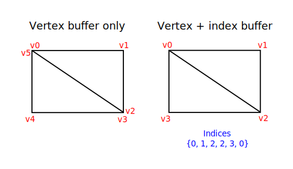

# Index buffer

**Code:** [main.rs](https://github.com/KyleMayes/vulkanalia/tree/master/tutorial/src/20_index_buffer.rs)

The 3D meshes you'll be rendering in a real world application will often share vertices between multiple triangles. This already happens even with something simple like drawing a rectangle:



Drawing a rectangle takes two triangles, which means that we need a vertex buffer with 6 vertices. The problem is that the data of two vertices needs to be duplicated resulting in 50% redundancy. It only gets worse with more complex meshes, where vertices are reused in an average number of 3 triangles. The solution to this problem is to use an *index buffer*.

An index buffer is essentially an array of pointers into the vertex buffer. It allows you to reorder the vertex data, and reuse existing data for multiple vertices. The illustration above demonstrates what the index buffer would look like for the rectangle if we have a vertex buffer containing each of the four unique vertices. The first three indices define the upper-right triangle and the last three indices define the vertices for the bottom-left triangle.

## Index buffer creation

In this chapter we're going to modify the vertex data and add index data to draw a rectangle like the one in the illustration. Modify the vertex data to represent the four corners:

```rust,noplaypen
lazy_static! {
    static ref VERTICES: Vec<Vertex> = vec![
        Vertex::new(glm::vec2(-0.5, -0.5), glm::vec3(1.0, 0.0, 0.0)),
        Vertex::new(glm::vec2(0.5, -0.5), glm::vec3(0.0, 1.0, 0.0)),
        Vertex::new(glm::vec2(0.5, 0.5), glm::vec3(0.0, 0.0, 1.0)),
        Vertex::new(glm::vec2(-0.5, 0.5), glm::vec3(1.0, 1.0, 1.0)),
    ];
}
```

The top-left corner is red, top-right is green, bottom-right is blue and the bottom-left is white. We'll add a new array `INDICES` to represent the contents of the index buffer. It should match the indices in the illustration to draw the upper-right triangle and bottom-left triangle.

```rust,noplaypen
const INDICES: &[u16] = &[0, 1, 2, 2, 3, 0];
```

It is possible to use either `u16` or `u32` for your index buffer depending on the number of entries in `VERTICES`. We can stick to `u16` for now because we're using less than 65,536 unique vertices.

Just like the vertex data, the indices need to be uploaded into a `vk::Buffer` for the GPU to be able to access them. Define two new `AppData` fields to hold the resources for the index buffer:

```rust,noplaypen
struct AppData {
    // ...
    vertex_buffer: vk::Buffer,
    vertex_buffer_memory: vk::DeviceMemory,
    index_buffer: vk::Buffer,
    index_buffer_memory: vk::DeviceMemory,
}
```

The `create_index_buffer` function that we'll add now is almost identical to `create_vertex_buffer`:

```rust,noplaypen
impl App {
    unsafe fn create(window: &Window) -> Result<Self> {
        // ...
        create_vertex_buffer(&instance, &device, &mut data)?;
        create_index_buffer(&instance, &device, &mut data)?;
        // ...
    }
}

unsafe fn create_index_buffer(
    instance: &Instance,
    device: &Device,
    data: &mut AppData,
) -> Result<()> {
    let size = (size_of::<u16>() * INDICES.len()) as u64;

    let (staging_buffer, staging_buffer_memory) = create_buffer(
        instance,
        device,
        data,
        size,
        vk::BufferUsageFlags::TRANSFER_SRC,
        vk::MemoryPropertyFlags::HOST_COHERENT | vk::MemoryPropertyFlags::HOST_VISIBLE,
    )?;

    let memory = device.map_memory(
        staging_buffer_memory,
        0,
        size,
        vk::MemoryMapFlags::empty(),
    )?;

    memcpy(INDICES.as_ptr(), memory.cast(), INDICES.len());

    device.unmap_memory(staging_buffer_memory);

    let (index_buffer, index_buffer_memory) = create_buffer(
        instance,
        device,
        data,
        size,
        vk::BufferUsageFlags::TRANSFER_DST | vk::BufferUsageFlags::INDEX_BUFFER,
        vk::MemoryPropertyFlags::DEVICE_LOCAL,
    )?;

    data.index_buffer = index_buffer;
    data.index_buffer_memory = index_buffer_memory;

    copy_buffer(device, data, staging_buffer, index_buffer, size)?;

    device.destroy_buffer(staging_buffer, None);
    device.free_memory(staging_buffer_memory, None);

    Ok(())
}
```

There are only two notable differences. The `size` is now equal to the number of indices times the size of the index type, either `u16` or `u32`. The usage of the `index_buffer` should be `vk::BufferUsageFlags::INDEX_BUFFER` instead of `vk::BufferUsageFlags::VERTEX_BUFFER`, which makes sense. Other than that, the process is exactly the same. We create a staging buffer to copy the contents of `INDICES` to and then copy it to the final device local index buffer.

The index buffer should be cleaned up at the end of the program, just like the vertex buffer:

```rust,noplaypen
unsafe fn destroy(&mut self) {
    self.destroy_swapchain();
    self.device.destroy_buffer(self.data.index_buffer, None);
    self.device.free_memory(self.data.index_buffer_memory, None);
    self.device.destroy_buffer(self.data.vertex_buffer, None);
    self.device.free_memory(self.data.vertex_buffer_memory, None);
    // ...
}
```

## Using an index buffer

Using an index buffer for drawing involves two changes to `create_command_buffers`. We first need to bind the index buffer, just like we did for the vertex buffer. The difference is that you can only have a single index buffer. It's unfortunately not possible to use different indices for each vertex attribute, so we do still have to completely duplicate vertex data even if just one attribute varies.

```rust,noplaypen
device.cmd_bind_vertex_buffers(*command_buffer, 0, &[data.vertex_buffer], &[0]);
device.cmd_bind_index_buffer(*command_buffer, data.index_buffer, 0, vk::IndexType::UINT16);
```

An index buffer is bound with `cmd_bind_index_buffer` which has the index buffer, a byte offset into it, and the type of index data as parameters. As mentioned before, the possible types are `vk::IndexType::UINT16` and `vk::IndexType::UINT32`.

Just binding an index buffer doesn't change anything yet, we also need to change the drawing command to tell Vulkan to use the index buffer. Remove the `cmd_draw` line and replace it with `cmd_draw_indexed`:

```rust,noplaypen
device.cmd_draw_indexed(*command_buffer, INDICES.len() as u32, 1, 0, 0, 0);
```

A call to this function is very similar to `cmd_draw`. The first two parameters after the command buffer specify the number of indices and the number of instances. We're not using instancing, so just specify `1` instance. The number of indices represents the number of vertices that will be passed to the vertex buffer. The next parameter specifies an offset into the index buffer, using a value of `1` would cause the graphics card to start reading at the second index. The second to last parameter specifies an offset to add to the indices in the index buffer. The final parameter specifies an offset for instancing, which we're not using.

Now run your program and you should see the following:


You now know how to save memory by reusing vertices with index buffers. This will become especially important in a future chapter where we're going to load complex 3D models.

The previous chapter already mentioned that you should allocate multiple resources like buffers from a single memory allocation, but in fact you should go a step further. [Driver developers recommend](https://developer.nvidia.com/vulkan-memory-management) that you also store multiple buffers, like the vertex and index buffer, into a single `vk::Buffer` and use offsets in commands like `cmd_bind_vertex_buffers`. The advantage is that your data is more cache friendly in that case, because it's closer together. It is even possible to reuse the same chunk of memory for multiple resources if they are not used during the same render operations, provided that their data is refreshed, of course. This is known as *aliasing* and some Vulkan functions have explicit flags to specify that you want to do this.
