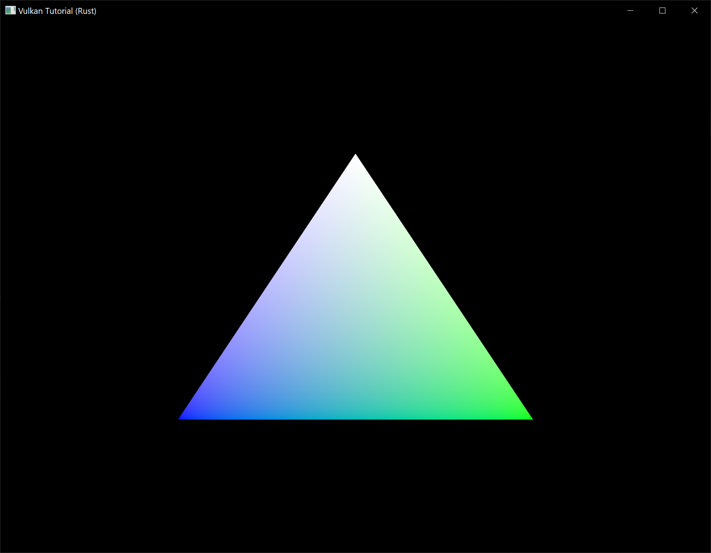

# Vertex buffer creation

**Code:** [main.rs](https://github.com/KyleMayes/vulkanalia/tree/master/tutorial/src/18_vertex_buffer.rs)

Buffers in Vulkan are regions of memory used for storing arbitrary data that can be read by the graphics card. They can be used to store vertex data, which we'll do in this chapter, but they can also be used for many other purposes that we'll explore in future chapters. Unlike the Vulkan objects we've been dealing with so far, buffers do not automatically allocate memory for themselves. The work from the previous chapters has shown that the Vulkan API puts the programmer in control of almost everything and memory management is one of those things.

## Buffer creation

Create a new function `create_vertex_buffer` and call it from `App::create` right before `create_command_buffers`.

```rust,noplaypen
impl App {
    unsafe fn create(window: &Window) -> Result<Self> {
        // ...
        create_vertex_buffer(&instance, &device, &mut data)?;
        create_command_buffers(&device, &mut data)?;
        // ...
    }
}

unsafe fn create_vertex_buffer(
    instance: &Instance,
    device: &Device,
    data: &mut AppData,
) -> Result<()> {
    Ok(())
}
```

Creating a buffer requires us to fill a `vk::BufferCreateInfo` structure.

```rust,noplaypen
let buffer_info = vk::BufferCreateInfo::builder()
    .size((size_of::<Vertex>() * VERTICES.len()) as u64)
    // continued...
```

The first field of the struct is `size`, which specifies the size of the buffer in bytes. Calculating the byte size of the vertex data is straightforward with `size_of`.

```rust,noplaypen
    .usage(vk::BufferUsageFlags::VERTEX_BUFFER)
```

The second field is `usage`, which indicates for which purposes the data in the buffer is going to be used. It is possible to specify multiple purposes using a bitwise or. Our use case will be a vertex buffer, we'll look at other types of usage in future chapters.

```rust,noplaypen
    .sharing_mode(vk::SharingMode::EXCLUSIVE);
```

Just like the images in the swapchain, buffers can also be owned by a specific queue family or be shared between multiple at the same time. The buffer will only be used from the graphics queue, so we can stick to exclusive access.

```rust,noplaypen
    .flags(vk::BufferCreateFlags::empty()); // Optional.
```

The `flags` parameter is used to configure sparse buffer memory, which is not relevant right now. You can omit the builder method for this field which will set it to the default value (an empty set of flags).

We can now create the buffer with `create_buffer`. First, define an `AppData` field to hold the buffer handle and call it `vertex_buffer`.

```rust,noplaypen
struct AppData {
    // ...
    vertex_buffer: vk::Buffer,
}
```

Next add the call to `create_buffer`:

```rust,noplaypen
unsafe fn create_vertex_buffer(
    instance: &Instance,
    device: &Device,
    data: &mut AppData,
) -> Result<()> {
    let buffer_info = vk::BufferCreateInfo::builder()
        .size((size_of::<Vertex>() * VERTICES.len()) as u64)
        .usage(vk::BufferUsageFlags::VERTEX_BUFFER)
        .sharing_mode(vk::SharingMode::EXCLUSIVE);

    data.vertex_buffer = device.create_buffer(&buffer_info, None)?;

    Ok(())
}
```

The buffer should be available for use in rendering commands until the end of the program and it does not depend on the swapchain, so we'll clean it up in the original `App::destroy` method:

```rust,noplaypen
unsafe fn destroy(&mut self) {
    self.destroy_swapchain();
    self.device.destroy_buffer(self.data.vertex_buffer, None);
    // ...
}
```

## Memory requirements

The buffer has been created, but it doesn't actually have any memory assigned to it yet. The first step of allocating memory for the buffer is to query its memory requirements using the aptly named `get_buffer_memory_requirements` command.

```rust,noplaypen
let requirements = device.get_buffer_memory_requirements(data.vertex_buffer);
```

The `vk::MemoryRequirements` struct this command returns has three fields:

* `size` &ndash; The size of the required amount of memory in bytes, may differ from `bufferInfo.size`.
* `alignment` &ndash; The offset in bytes where the buffer begins in the allocated region of memory, depends on `buffer_info.usage` and `buffer_info.flags`.
* `memory_type_bits` &ndash; Bit field of the memory types that are suitable for the buffer.

Graphics cards can offer different types of memory to allocate from. Each type of memory varies in terms of allowed operations and performance characteristics. We need to combine the requirements of the buffer and our own application requirements to find the right type of memory to use. Let's create a new function `get_memory_type_index` for this purpose.

```rust,noplaypen
unsafe fn get_memory_type_index(
    instance: &Instance,
    data: &AppData,
    properties: vk::MemoryPropertyFlags,
    requirements: vk::MemoryRequirements,
) -> Result<u32> {
}
```

First we need to query info about the available types of memory using `get_physical_device_memory_properties`.

```rust,noplaypen
let memory = instance.get_physical_device_memory_properties(data.physical_device);
```

The returned `vk::PhysicalDeviceMemoryProperties` structure has two arrays `memory_types` and `memory_heaps`. Memory heaps are distinct memory resources like dedicated VRAM and swap space in RAM for when VRAM runs out. The different types of memory exist within these heaps. Right now we'll only concern ourselves with the type of memory and not the heap it comes from, but you can imagine that this can affect performance.

Let's first find a memory type that is suitable for the buffer itself:

```rust,noplaypen
(0..memory.memory_type_count)
    .find(|i| (requirements.memory_type_bits & (1 << i)) != 0)
    .ok_or_else(|| anyhow!("Failed to find suitable memory type."))
```

The `memory_type_bits` field from the `requirements` parameter will be used to specify the bit field of memory types that are suitable. That means that we can find the index of a suitable memory type by simply iterating over them and checking if the corresponding bit is set to `1`.

However, we're not just interested in a memory type that is suitable for the vertex buffer. We also need to be able to write our vertex data to that memory. The `memory_types` array consists of `vk::MemoryType` structs that specify the heap and properties of each type of memory. The properties define special features of the memory, like being able to map it so we can write to it from the CPU. This property is indicated with `vk::MemoryPropertyFlags::HOST_VISIBLE`, but we also need to use the `vk::MemoryPropertyFlags::HOST_COHERENT` property. We'll see why when we map the memory.

We can now modify the loop to also check for the support of this property:

```rust,noplaypen
(0..memory.memory_type_count)
    .find(|i| {
        let suitable = (requirements.memory_type_bits & (1 << i)) != 0;
        let memory_type = memory.memory_types[*i as usize];
        suitable && memory_type.property_flags.contains(properties)
    })
    .ok_or_else(|| anyhow!("Failed to find suitable memory type."))
```

If there is a memory type suitable for the buffer that also has all of the properties we need, then we return its index, otherwise we return an error.

## Memory allocation

We now have a way to determine the right memory type, so we can actually allocate the memory by filling in the `vk::MemoryAllocateInfo` structure.

```rust,noplaypen
let memory_info = vk::MemoryAllocateInfo::builder()
    .allocation_size(requirements.size)
    .memory_type_index(get_memory_type_index(
        instance,
        data,
        vk::MemoryPropertyFlags::HOST_COHERENT | vk::MemoryPropertyFlags::HOST_VISIBLE,
        requirements,
    )?);
```

Memory allocation is now as simple as specifying the size and type, both of which are derived from the memory requirements of the vertex buffer and the desired property. Create an `AppData` field to store the handle to the memory:

```rust,noplaypen
struct AppData {
    // ...
    vertex_buffer: vk::Buffer,
    vertex_buffer_memory: vk::DeviceMemory,
}
```

Populate that new field by calling `allocate_memory`:

```rust,noplaypen
data.vertex_buffer_memory = device.allocate_memory(&memory_info, None)?;
```

If memory allocation was successful, then we can now associate this memory with the buffer using `bind_buffer_memory`:

```rust,noplaypen
device.bind_buffer_memory(data.vertex_buffer, data.vertex_buffer_memory, 0)?;
```

The first two parameters are self-explanatory and the third parameter is the offset within the region of memory. Since this memory is allocated specifically for this the vertex buffer, the offset is simply `0`. If the offset is non-zero, then it is required to be divisible by `requirements.alignment`.

Of course, just like dynamic memory allocation in C, the memory should be freed at some point. Memory that is bound to a buffer object may be freed once the buffer is no longer used, so let's free it after the buffer has been destroyed:

```rust,noplaypen
unsafe fn destroy(&mut self) {
    self.destroy_swapchain();
    self.device.destroy_buffer(self.data.vertex_buffer, None);
    self.device.free_memory(self.data.vertex_buffer_memory, None);
    // ...
}
```

## Filling the vertex buffer

It is now time to copy the vertex data to the buffer. This is done by [mapping the buffer memory](https://en.wikipedia.org/wiki/Memory-mapped_I/O) into CPU accessible memory with `map_memory`.

```rust,noplaypen
let memory = device.map_memory(
    data.vertex_buffer_memory,
    0,
    buffer_info.size,
    vk::MemoryMapFlags::empty(),
)?;
```

This command allows us to access a region of the specified memory resource defined by an offset and size. The offset and size here are `0` and `buffer_info.size`, respectively. It is also possible to specify the special value `vk::WHOLE_SIZE` to map all of the memory. The last parameter can be used to specify flags, but there aren't any available yet in the current API. It must be set to an empty set of flags. The returned value is the pointer to the mapped value.

Before we continue, we'll need to be able copy memory from our vertex list to the mapped memory. Add this import to your program:

```rust,noplaypen
use std::ptr::copy_nonoverlapping as memcpy;
```

Now we can copy the vertex data into the buffer memory and then unmap it again using `unmap_memory`.

```rust,noplaypen
memcpy(VERTICES.as_ptr(), memory.cast(), VERTICES.len());
device.unmap_memory(data.vertex_buffer_memory);
```

Unfortunately the driver may not immediately copy the data into the buffer memory, for example because of caching. It is also possible that writes to the buffer are not visible in the mapped memory yet. There are two ways to deal with that problem:

* Use a memory heap that is host coherent, indicated with `vk::MemoryPropertyFlags::HOST_COHERENT`
* Call `flush_mapped_memory_ranges` after writing to the mapped memory, and call `invalidate_mapped_memory_ranges` before reading from the mapped memory

We went for the first approach, which ensures that the mapped memory always matches the contents of the allocated memory. Do keep in mind that this may lead to slightly worse performance than explicit flushing, but we'll see why that doesn't matter in the next chapter.

Flushing memory ranges or using a coherent memory heap means that the driver will be aware of our writes to the buffer, but it doesn't mean that they are actually visible on the GPU yet. The transfer of data to the GPU is an operation that happens in the background and the specification simply [tells us](https://www.khronos.org/registry/vulkan/specs/1.0/html/vkspec.html#synchronization-submission-host-writes) that it is guaranteed to be complete as of the next call to `queue_submit`.

## Binding the vertex buffer

All that remains now is binding the vertex buffer during rendering operations. We're going to extend the `create_command_buffers` function to do that.

```rust,noplaypen
// ...
device.cmd_bind_vertex_buffers(*command_buffer, 0, &[data.vertex_buffer], &[0]);
device.cmd_draw(*command_buffer, VERTICES.len() as u32, 1, 0, 0);
// ...
```

The `cmd_bind_vertex_buffers` command is used to bind vertex buffers to bindings, like the one we set up in the previous chapter. The second parameter specifies the index of the vertex input binding we are using. The last two parameters specify the vertex buffers to bind and the byte offsets to start reading vertex data from. You should also change the call to `cmd_draw` to pass the number of vertices in the buffer as opposed to the hardcoded number `3`.

Now run the program and you should see the familiar triangle again:


Try changing the color of the top vertex to white by modifying the `VERTICES` list:

```rust,noplaypen
lazy_static! {
    static ref VERTICES: Vec<Vertex> = vec![
        Vertex::new(glm::vec2(0.0, -0.5), glm::vec3(1.0, 1.0, 1.0)),
        Vertex::new(glm::vec2(0.5, 0.5), glm::vec3(0.0, 1.0, 0.0)),
        Vertex::new(glm::vec2(-0.5, 0.5), glm::vec3(0.0, 0.0, 1.0)),
    ];
}
```

Run the program again and you should see the following:



In the next chapter we'll look at a different way to copy vertex data to a vertex buffer that results in better performance, but takes some more work.
